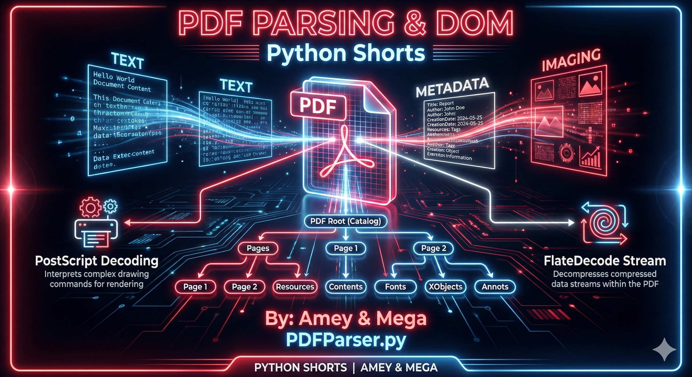
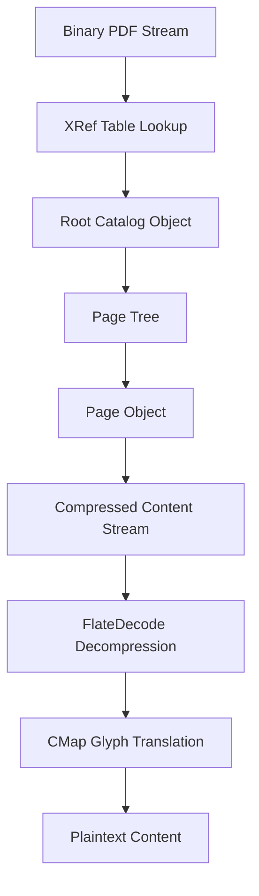
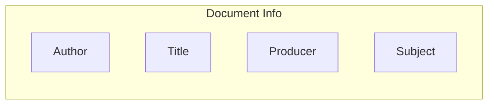

# PDF Parser (Document Object Model & Stream Extraction)

**Authors:**
- [Amey Thakur](https://github.com/Amey-Thakur) ([ORCID: 0000-0001-5644-1575](https://orcid.org/0000-0001-5644-1575))
- [Mega Satish](https://github.com/msatmod) ([ORCID: 0000-0002-1844-9557](https://orcid.org/0000-0002-1844-9557))

**Release Date:** January 9, 2022  
**License:** MIT License

---

## Quick Start
To execute this implementation, install the required dependency and run:
```bash
pip install -r requirements.txt
python PDFParser.py
```

## 1. Definition
A **PDF Parser** is a tool designed to decode the **Portable Document Format (PDF)**, a file format developed by Adobe in 1992. PDF parsing is non-trivial because the format is a specialized object-oriented language based on PostScript, where text is often stored as compressed streams of glyph offsets rather than plain strings.

## 2. Mathematical & Structural Explanation
A PDF file consists of four primary sections:
1.  **Header**: Specifies the PDF version (e.g., `%PDF-1.7`).
2.  **Body**: Contains the objects (Fonts, Images, Text Streams, Pages).
3.  **Cross-Reference Table (XRef)**: Lists the byte-offsets of all objects, allowing random access.
4.  **Trailer**: Points to the root object and the XRef table.

The extraction logic follows the **Object Hierarchy**:

$$
Catalog \rightarrow Pages \rightarrow Page \rightarrow Contents \rightarrow Stream
$$

Text within a stream is often compressed using the **FlateDecode** algorithm (based on zlib/deflate). The parser must decompress this stream and use **Character Maps (CMaps)** to translate font-specific codes back into Unicode characters.

## 3. Computer Science Theory
- **Serialization**: PDF is a serialized graph of objects. The parser performs a "lazy" traversal, only loading objects from disk as requested by following the XRef offsets.
- **Forensic Analysis**: Metadata extraction (Author, Producer) allows for identification of the document's origins and editing history.
- **Encoding Challenges**: Modern PDFs use Identity-H encoding, which requires complex mapping tables between CID (Character ID) and Unicode.
- **Resource Management**: Large PDFs are handled by reading stream objects in chunks to avoid memory overflow.

## 4. Python Implementation Logic
- **`PDFParserService`**: Integrates with `PyPDF2` to provide a clean, scholarly API for document interrogation.
- **Metadata Retrieval**: Accesses the `/Info` dictionary of the PDF trailer to pull standard bibliographic attributes.
- **Text Extraction**: Iterates through the `PdfReader.pages` collection, invoking character-mapping logic to reconstruct human-readable paragraphs.
- **Error Resilience**: Implements guards against missing files or missing library dependencies.

## 5. Visual Representation

### PDF Internal Topology & Extraction Flow





