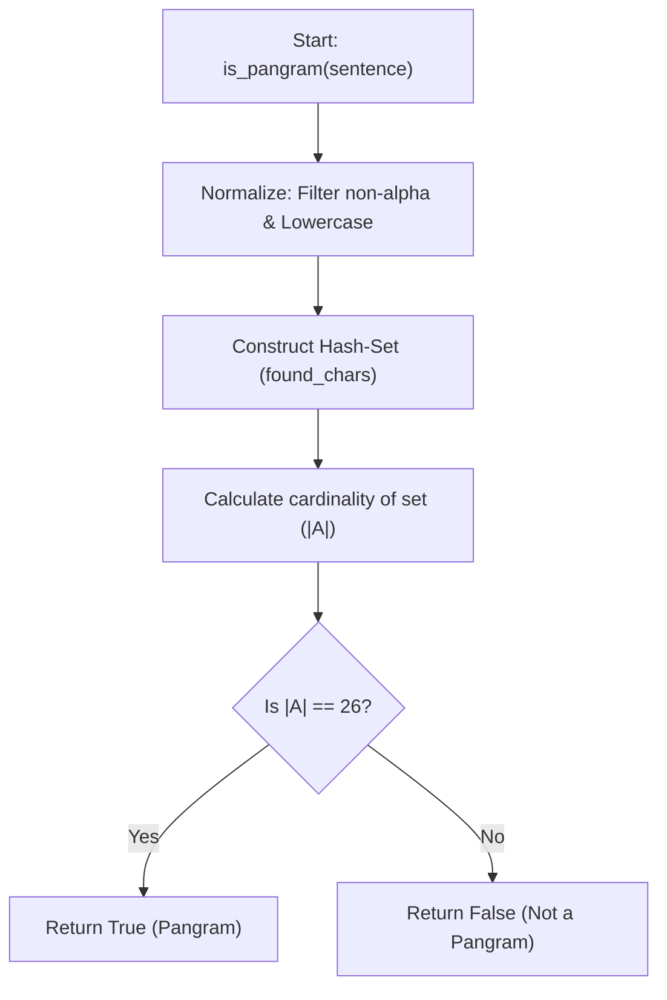
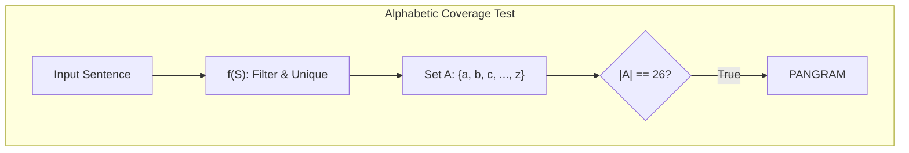

# Pangram (Set Cardinality & Alphabetic Coverage)

**Authors:**
- [Amey Thakur](https://github.com/Amey-Thakur) ([ORCID: 0000-0001-5644-1575](https://orcid.org/0000-0001-5644-1575))
- [Mega Satish](https://github.com/msatmod) ([ORCID: 0000-0002-1844-9557](https://orcid.org/0000-0002-1844-9557))

**Release Date:** January 9, 2022  
**License:** MIT License

---

## Quick Start
To execute this implementation, ensure you have Python 3.x installed and follow these steps:
```bash
python Pangram.py
```

## 1. Definition
A **Pangram** (or holoalphabetic sentence) is a sentence using every letter of a given alphabet at least once. The most famous example in English is "The quick brown fox jumps over the lazy dog". From a linguistic and computational perspective, it represents a complete coverage of a character set.

## 2. Mathematical Explanation
The verification of a pangram can be modeled using **Set Theory**.

### Set Cardinality
Let $L$ be the set of all lowercase letters in the English alphabet:
$L = \{a, b, c, \dots, z\}$, where $|L| = 26$.

Let $S$ be the input string. We define a transformation function $f(S)$ that maps $S$ to a set of its unique lowercase alphabetic characters:
$A = \{char.lower() \mid char \in S, char \in alphabet\}$

The string $S$ is a pangram if:
$L \subseteq A$

Since $A$ is restricted to alphabetic characters, this is equivalent to checking if the cardinality of $A$ is equal to 26:
$|A| = 26$

## 3. Computer Science Theory
- **Complexity**:
    - **Time Complexity**: $O(n)$, where $n$ is the length of the string. We must iterate through the string once to build the set of unique characters.
    - **Space Complexity**: $O(1)$ auxiliary space. Although we create a set, its maximum size is fixed at 26 (the number of letters in the alphabet), which is constant regardless of the input size $n$.
- **Hash-Set Optimization**: The use of a hash-set allows for $O(1)$ average-time insertion and lookups, ensuring that the overall verification remains strictly linear.

## 4. Python Implementation Logic
- **Set Comprehension**: Efficiently constructs the set of unique characters while simultaneously performing normalization (lowercasing and alphabetic filtering).
- **String Constants**: Utilizes `string.ascii_lowercase` for a robust reference to the target character set.

## 5. Visual Representation

### Alphabetic Coverage & Set Cardinality





