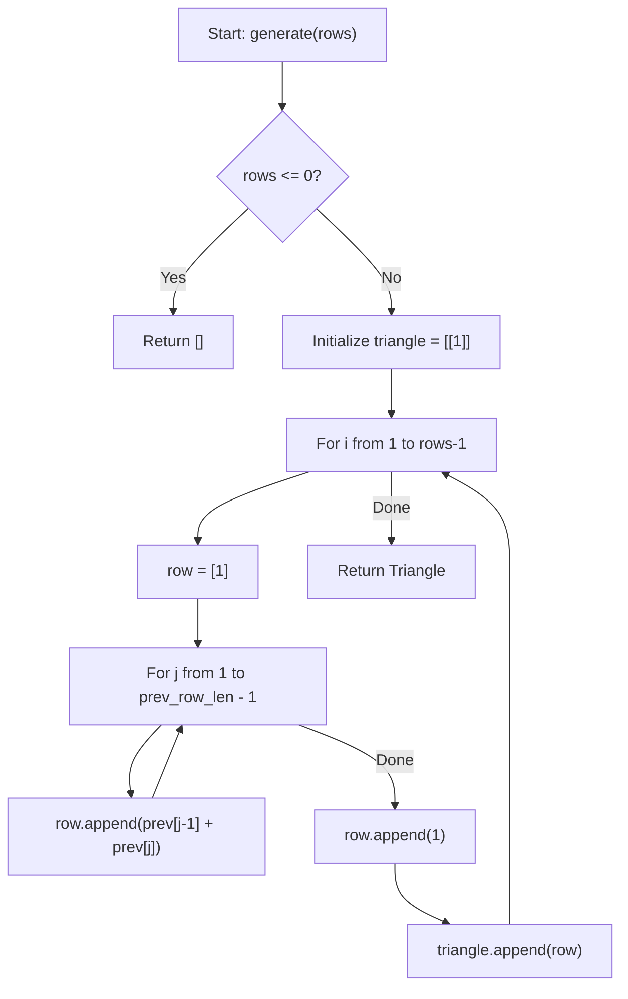
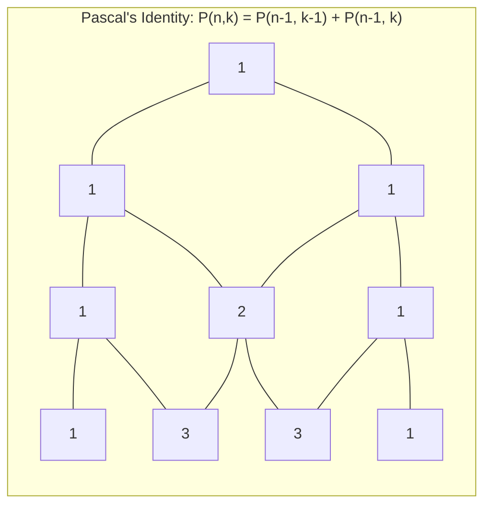

# Pascal Triangle (Combinatorics & Binomial Coefficients)

**Authors:**
- [Amey Thakur](https://github.com/Amey-Thakur) ([ORCID: 0000-0001-5644-1575](https://orcid.org/0000-0001-5644-1575))
- [Mega Satish](https://github.com/msatmod) ([ORCID: 0000-0002-1844-9557](https://orcid.org/0000-0002-1844-9557))

**Release Date:** January 9, 2022  
**License:** MIT License

---

## Quick Start
To execute this implementation, ensure you have Python 3.x installed and follow these steps:
```bash
python PascalTriangle.py
```

## 1. Definition
**Pascal's Triangle** is a triangular array of **Binomial Coefficients**. To construct the triangle, start with "1" at the apex. Each subsequent number is determined by summing the two numbers directly above it. This structure is fundamental in probability theory, combinatorics, and algebra.

## 2. Mathematical Explanation
Pascal's Triangle is a manifestation of the **Binomial Theorem**.

### Pascal's Identity
Each entry $P_{n,k}$ at row $n$ and column $k$ (where $n, k \geq 0$) is defined by the identity:

$$
P_{n,k} = P_{n-1,k-1} + P_{n-1,k}
$$

With boundary conditions $P_{n,0} = P_{n,n} = 1$.

### Combinatorial Formula
The value $P_{n,k}$ is equivalent to the binomial coefficient "n choose k":

$$
\binom{n}{k} = \frac{n!}{k!(n-k)!}
$$

This represents the number of ways to pick $k$ elements from a set of $n$ elements.

### Symmetry and Properties
- **Symmetry**: The triangle is symmetric around its vertical axis: $\binom{n}{k} = \binom{n}{n-k}$.
- **Horizontal Sums**: The sum of elements in the $n$-th row is $2^n$.
- **Prime Divisibility**: If $n$ is a prime number, all interior entries in the $n$-th row are divisible by $n$.

## 3. Computer Science Theory
- **Complexity**:
    - **Time Complexity**: $O(n^2)$, where $n$ is the number of rows. Each element is computed as a single addition.
    - **Space Complexity**: $O(n^2)$ to store the entire triangle, or $O(n)$ if only the previous row is maintained for iterative generation.
- **Dynamic Programming**: This implementation utilizes a bottom-up dynamic programming approach (iterative), which is significantly more efficient than a naive recursive approach that would result in $O(2^n)$ redundant calculations.

## 4. Python Implementation Logic
- **Iterative Row Construction**: Uses a nested loop to calculate the next row based on the values in the current `triangle[-1]` list.
- **Formatted Alignment**: Employs string centering and fixed-width spacing to preserve the triangular visual structure in the terminal output.

## 5. Visual Representation

### Binomial Symmetry & Combinatorial Logic





