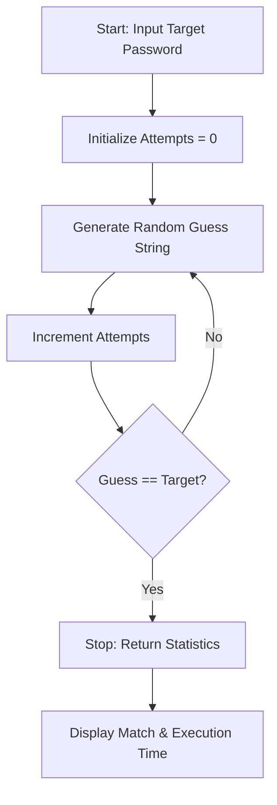

# Password Guesser (Combinatorial Search & Brute-Force Theory)

**Authors:**
- [Amey Thakur](https://github.com/Amey-Thakur) ([ORCID: 0000-0001-5644-1575](https://orcid.org/0000-0001-5644-1575))
- [Mega Satish](https://github.com/msatmod) ([ORCID: 0000-0002-1844-9557](https://orcid.org/0000-0002-1844-9557))

**Release Date:** January 9, 2022  
**License:** MIT License

---

## Quick Start
To execute this implementation, ensure you have Python 3.x installed and follow these steps:
```bash
python Password_Guesser.py
```

## 1. Definition
A **Password Guesser** is a computational simulation of a **Brute-Force Attack**. In cryptography, brute-force consists of an attacker submitting many passwords or passphrases with the hope of eventually guessing correctly. It is the most basic form of cryptanalysis and serves as a benchmark for measuring the strength of authentication systems.

## 2. Mathematical Explanation
The complexity of guessing a password is rooted in **Combinatorics**.

### Search Space Complexity
If a password has a fixed length $L$ and each character is chosen from an alphabet $A$ of size $|A|$, the total number of possible combinations (the search space $S$) is:

$$
S = |A|^L
$$

As $L$ increases, the search space grows at an exponential rate. This is known as **Combinatorial Explosion**.

### Probability of Success
For a truly random search where samples are taken with replacement, the probability $P$ of matching the target in a single attempt is:

$$
P = \frac{1}{|A|^L}
$$

The expected number of attempts required to find the target is $S / 2$.

## 3. Computer Science Theory
- **Complexity**:
    - **Time Complexity**: $O(|A|^L)$ in the worst case. This makes brute-forcing computationally infeasible for large values of $L$ (e.g., $L > 12$ with complex alphabets).
    - **Space Complexity**: $O(L)$ to store the current guess string.
- **Search Optimization**: While this implementation uses randomized sampling, real-world tools often use dictionary attacks or heuristic-based priority queues to reduce the effective search space.

## 4. Python Implementation Logic
- **Randomized Sampling**: Utilizes `random.choice()` within a generator expression to build candidate strings.
- **Iteration Loop**: Employs a `while` loop that continues until the `guess` string matches the `target`.
- **Performance Tracking**: Uses the `time` module to measure the wall-clock duration of the search operation.

## 5. Visual Representation


