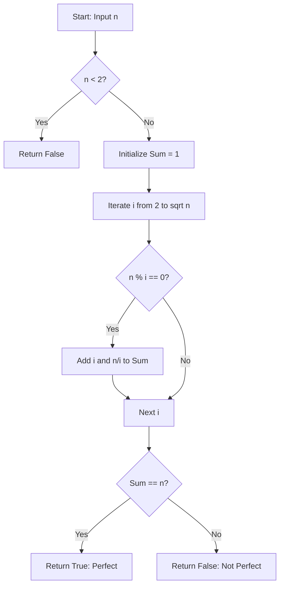

# Perfect Number (Aliquot Sums & Number Theory)

**Authors:**
- [Amey Thakur](https://github.com/Amey-Thakur) ([ORCID: 0000-0001-5644-1575](https://orcid.org/0000-0001-5644-1575))
- [Mega Satish](https://github.com/msatmod) ([ORCID: 0000-0002-1844-9557](https://orcid.org/0000-0002-1844-9557))

**Release Date:** January 9, 2022  
**License:** MIT License

---

## Quick Start
To execute this implementation, ensure you have Python 3.x installed and follow these steps:
```bash
python PerfectNumber.py
```

## 1. Definition
In number theory, a **Perfect Number** is a positive integer that is equal to the sum of its proper positive divisors (the sum of its positive divisors excluding the number itself). This sum is known as the **Aliquot Sum**.

## 2. Mathematical Explanation
A perfect number $n$ can be defined through the **Divisor Function** $\sigma_1(n)$, which is the sum of all divisors of $n$.

### The Perfect Condition
A number $n$ is perfect if:

$$
\sigma_1(n) = 2n
$$

Or, equivalently, if the aliquot sum $s(n)$ satisfies:

$$
s(n) = \sigma_1(n) - n = n
$$

### Euclid-Euler Theorem
The Euclid-Euler Theorem relates even perfect numbers to **Mersenne Primes**. An even number $n$ is perfect if and only if it has the form:

$$
n = 2^{p-1} (2^p - 1)
$$

where $2^p - 1$ is a Mersenne prime (and $p$ itself must be prime).

## 3. Computer Science Theory
- **Complexity**:
    - **Time Complexity**: $O(\sqrt{n})$. By iterating only up to $\sqrt{n}$, we can find all divisor pairs $(i, n/i)$ in sub-linear time.
    - **Space Complexity**: $O(1)$ auxiliary space.
- **Search Optimization**: The reduction from $O(n)$ to $O(\sqrt{n})$ is critical for verifying large candidate numbers (e.g., verifying 8128 requires only 90 iterations instead of 8127).

## 4. Python Implementation Logic
- **Iterative Divisor Pairing**: Loops from 2 to $\lfloor \sqrt{n} \rfloor$ and adds both $i$ and $n/i$ to the running sum if $i$ is a divisor.
- **Boundary Handling**: Explicitly handles cases where $n$ is a perfect square to avoid double-counting the square root.

## 5. Visual Representation


