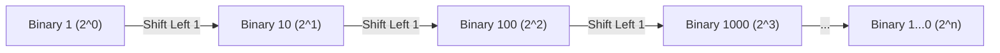

# Power2 Sequence (Geometric Progressions & Bitwise Operations)

**Authors:**
- [Amey Thakur](https://github.com/Amey-Thakur) ([ORCID: 0000-0001-5644-1575](https://orcid.org/0000-0001-5644-1575))
- [Mega Satish](https://github.com/msatmod) ([ORCID: 0000-0002-1844-9557](https://orcid.org/0000-0002-1844-9557))

**Release Date:** January 9, 2022  
**License:** MIT License

---

## Quick Start
To execute this implementation, ensure you have Python 3.x installed and follow these steps:
```bash
python Power2Sequence.py
```

## 1. Definition
The **Power2 Sequence** is a geometric progression where the first term is 1 ( $2^0$ ) and the common ratio is 2. In computer science, powers of two are foundational due to the binary nature of modern digital architectures, representing word sizes, memory address spaces, and data capacities.

## 2. Mathematical Explanation
A power of two is an exponential expression of the form $2^n$.

### Geometric Progression
The sequence $\{a_n\}$ is defined recursively as:

$$
a_0 = 1, \quad a_n = 2 \cdot a_{n-1}
$$

Or explicitly as:

$$
a_n = 2^n
$$

### Binary Representation
In base-2 (binary), every power of two $2^n$ is represented as a single bit set at position $n$ (indexed from 0) followed by $n$ zeros. For example:
- $2^0 = (1)_2$
- $2^1 = (10)_2$
- $2^2 = (100)_2$
- $2^3 = (1000)_2$

## 3. Computer Science Theory
- **Bitwise Shifts**: The most efficient way to calculate $2^n$ in a digital system is the **Bitwise Left-Shift** operation ( $1 \ll n$ ). Shifting the binary digit '1' to the left by $n$ positions is equivalent to multiplying by $2^n$.
- **Complexity**:
    - **Time Complexity**: $O(k)$ to generate $k$ terms, with each shift operation being $O(1)$.
    - **Space Complexity**: $O(k)$ to store the sequence.
- **Applications**: Power of two sequences are used in calculating heap sizes, hash table capacities, and implementing algorithms like Binary Search or Segment Trees.

## 4. Python Implementation Logic
- **List Comprehension**: Uses a concise syntax to iterate through the range and apply the bitwise operator.
- **Bitwise Optimization**: Replaces the standard exponentiation operator (`**`) with `1 << i`, which is a lower-level hardware instruction and generally more energy-efficient.

## 5. Visual Representation


