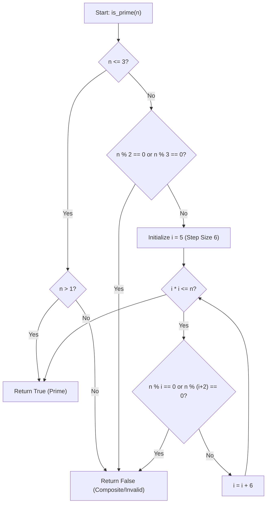
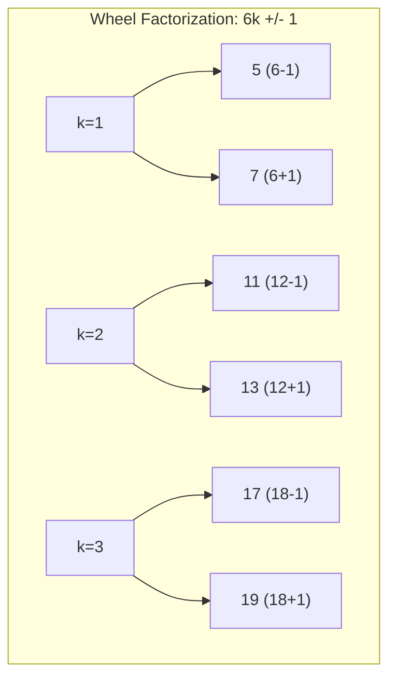

# Prime Number (Fundamental Theorem of Arithmetic & Primality Testing)

**Authors:**
- [Amey Thakur](https://github.com/Amey-Thakur) ([ORCID: 0000-0001-5644-1575](https://orcid.org/0000-0001-5644-1575))
- [Mega Satish](https://github.com/msatmod) ([ORCID: 0000-0002-1844-9557](https://orcid.org/0000-0002-1844-9557))

**Release Date:** January 9, 2022  
**License:** MIT License

---

## Quick Start
To execute this implementation, ensure you have Python 3.x installed and follow these steps:
```bash
python PrimeNumber.py
```

## 1. Definition
A **Prime Number** is a natural number greater than 1 that is not a product of two smaller natural numbers. In other words, its only divisors are 1 and itself. Integers greater than 1 that are not prime are called **Composite Numbers**.

## 2. Mathematical Explanation
Primality is the foundation of modern Number Theory and Cryptography.

### Fundamental Theorem of Arithmetic
Every integer greater than 1 can be represented uniquely (up to ordering) as a product of prime numbers. This is known as **Prime Factorization**.

### Primality Criterion
A number $n$ is prime if there exists no integer $d$ such that:
$1 < d \leq \sqrt{n}$ and $d \mid n$.

### $6k \pm 1$ Optimization
All prime numbers greater than 3 can be expressed in the form $6k \pm 1$ for some integer $k$. This is because all other forms ($6k$, $6k+2$, $6k+3$, $6k+4$) are divisible by 2 or 3. This property allows us to skip two-thirds of the numbers during trial division.

## 3. Computer Science Theory
- **Complexity**:
    - **Time Complexity**: $O(\sqrt{n})$. Trial division up to the square root is the most straightforward deterministic test.
    - **Space Complexity**: $O(1)$ auxiliary space.
- **Wheel Factorization**: This implementation uses a simple basis $\{2, 3\}$ to skip multiples of these primes, reducing the constant factor in the $O(\sqrt{n})$ complexity.
- **Applications**: Prime numbers are critical for RSA encryption, Hash table sizing (to minimize collisions), and Pseudo-Random Number Generation (PRNG).

## 4. Python Implementation Logic
- **Boundary Checks**: Handles $n \leq 3$ separately as base cases.
- **Divisibility Testing**: Uses the modulo operator (`%`) within a loop that increments by 6, checking both $i$ and $i+2$ in each iteration to cover the $6k \pm 1$ candidates.

## 5. Visual Representation

### Primality Distribution & Wheel Factorization





