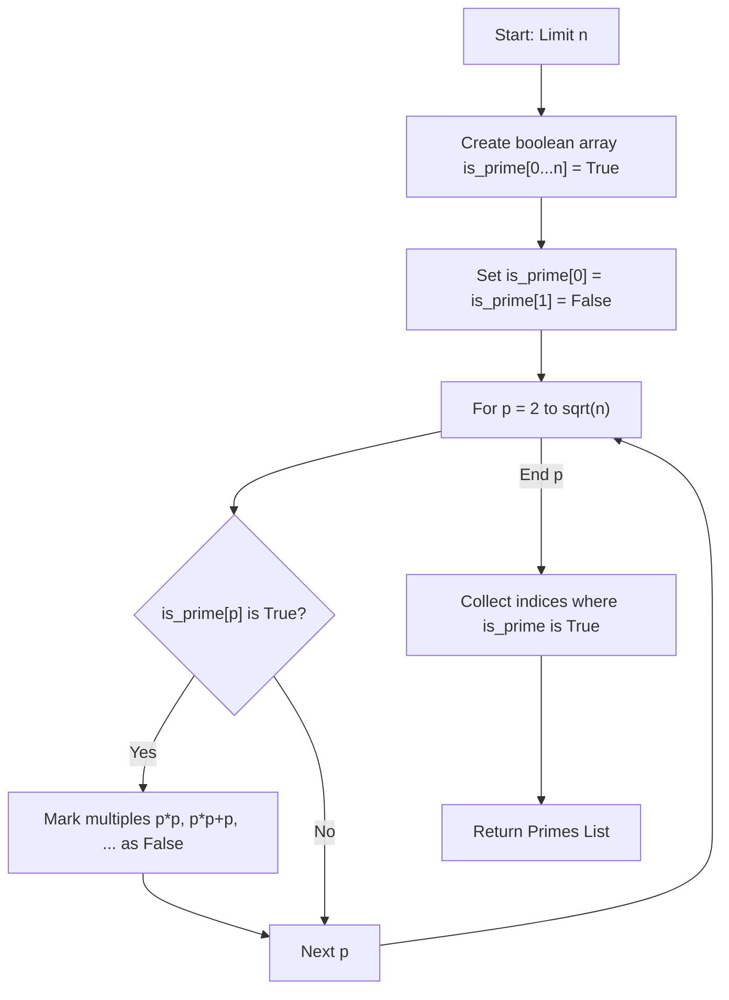
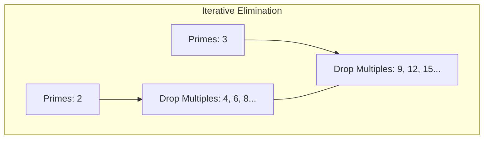

# Prime Sieve (Sieve of Eratosthenes & Number Theory)

**Authors:**
- [Amey Thakur](https://github.com/Amey-Thakur) ([ORCID: 0000-0001-5644-1575](https://orcid.org/0000-0001-5644-1575))
- [Mega Satish](https://github.com/msatmod) ([ORCID: 0000-0002-1844-9557](https://orcid.org/0000-0002-1844-9557))

**Release Date:** January 9, 2022  
**License:** MIT License

---

## Quick Start
To execute this implementation, ensure you have Python 3.x installed and follow these steps:
```bash
python PrimeSieve.py
```

## 1. Definition
The **Sieve of Eratosthenes** is a fast and simple ancient algorithm for finding all prime numbers up to any given limit. It does so by iteratively marking as composite (i.e., not prime) the multiples of each prime, starting with the first prime number, 2.

## 2. Mathematical Explanation
A prime number is a natural number greater than 1 that has no positive divisors other than 1 and itself. The sieve works by leveraging the fundamental theorem of arithmetic.

For a limit $n$, we only need to iterate up to $\sqrt{n}$. For any composite number $m \leq n$, it must have a prime factor $p \leq \sqrt{m} \leq \sqrt{n}$.

$$
\forall p \in [2, \sqrt{n}], \text{ if } p \in \text{Primes}, \text{ then } \{p \cdot k \mid k \in \mathbb{Z}, p \cdot k \leq n\} \notin \text{Primes}
$$

## 3. Computer Science Theory
- **Algorithm Efficiency**: The sieve has a time complexity of $O(n \log \log n)$, which is significantly better than testing each number individually ($O(n\sqrt{n})$).
- **Boolean Array Manipulation**: Uses a memory-contiguous array for fast marking and retrieval.
- **Space-Time Tradeoff**: Achieves high speed by using $O(n)$ space to store the primality status of every number up to the limit.
- **Number Theory Applications**: Essential in cryptography (generating large primes), data security (RSA), and mathematical modeling.

## 4. Python Implementation Logic
- **`PrimeSieveService`**: A dedicated class for prime generation with configurable limits.
- **Multiples Marking**: Uses range slicing and step-based iteration (`range(p*p, limit+1, p)`) for optimized marking.
- **List Comprehension**: Efficiently extracts the indices marked as `True` into the final result list.

## 5. Visual Representation

### The Filtering Process & Sieve Logic





