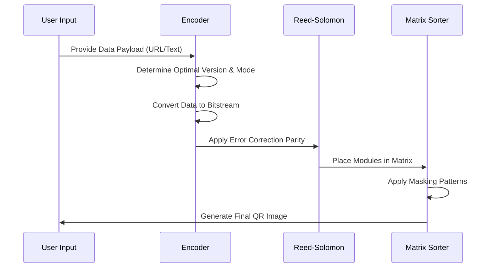
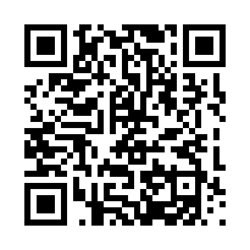
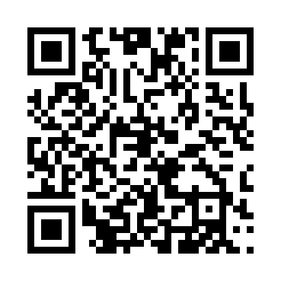
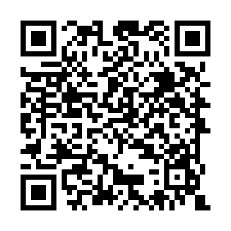

# QRCode (Reed-Solomon Error Correction & Matrix Encoding)

**Authors:**
- [Amey Thakur](https://github.com/Amey-Thakur) ([ORCID: 0000-0001-5644-1575](https://orcid.org/0000-0001-5644-1575))
- [Mega Satish](https://github.com/msatmod) ([ORCID: 0000-0002-1844-9557](https://orcid.org/0000-0002-1844-9557))

**Release Date:** January 9, 2022  
**License:** MIT License

---

## Quick Start
To execute this implementation, ensure you have Python 3.x and the `qrcode` library installed:
```bash
pip install qrcode[pil]
python QRCode.py
```

## 1. Definition
A **QR Code** (Quick Response Code) is a type of matrix barcode initially designed for the automotive industry. It is a machine-readable optical label that contains information about the item to which it is attached. Unlike standard barcodes, QR codes are two-dimensional, allowing for significantly higher data density.

## 2. Mathematical Explanation
QR code technology is underpinned by sophisticated coding theory and geometric patterns.

### Reed-Solomon Error Correction
The most critical mathematical component is **Reed-Solomon error correction**. This allows the QR code to be read even if it is dirty or partially damaged. The math relies on **Galois Field** $GF(2^8)$ arithmetic. Data is treated as coefficients of a polynomial:

$$
P(x) = a_{n-1}x^{n-1} + \dots + a_1x + a_0
$$

The encoder adds parity bits by dividing this polynomial by a generator polynomial. This redundancy allows the decoder to identify and correct errors up to a certain threshold (Level H allows for 30% recovery).

### Matrix Structure
- **Finder Patterns**: The three large squares at the corners used for orientation.
- **Alignment Patterns**: Smaller squares used to correct for perspective distortion.
- **Timing Patterns**: Lines of alternating black and white modules used to determine the central coordinate of each cell.

## 3. Computer Science Theory
- **Encoding Modes**: Data can be numeric, alphanumeric, byte/binary, or Kanji. Each mode uses a different bit-stream conversion logic.
- **Masking**: To ensure that the scanner doesn't misinterpret the data, a mask pattern is applied to the matrix to avoid large areas of identical color or patterns that look like finder patterns.
- **Complexity**:
    - **Time Complexity**: $O(N)$ where $N$ is the number of data bits.
    - **Space Complexity**: $O(V^2)$ where $V$ is the version of the QR code (determining the matrix size).

## 4. Python Implementation Logic
- **Library Integration**: Utilizes the `qrcode` library to handle the low-level bit-stream and Reed-Solomon generation.
- **Object-Oriented Design**: Encapsulates the generator parameters (version, box size, error correction) within a `QRGeneratorService` class for reusability.

## 5. Visual Representation

### Data Encoding Workflow


### Generated Scholarly Access Points
| Amey Thakur | Mega Satish | Repository |
| :---: | :---: | :---: |
|  |  |  |
