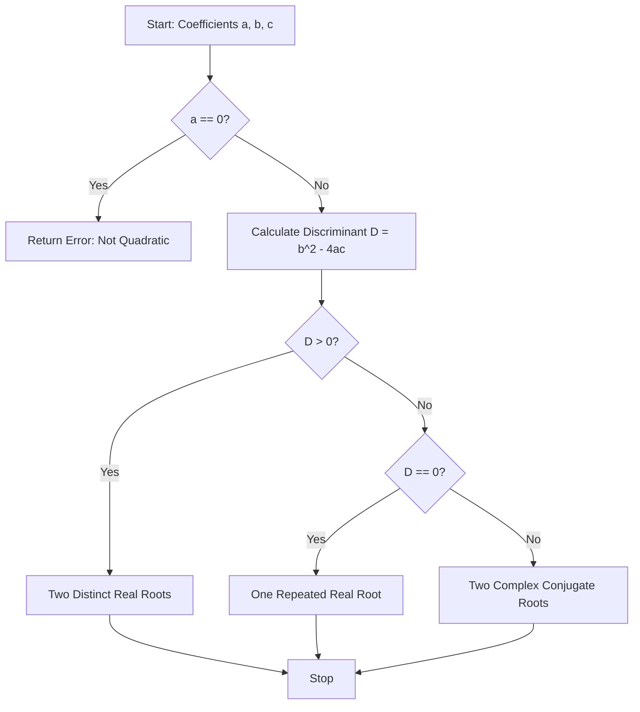

# Quadratic Equation Solver (Discriminant Theory & Complex Analysis)

**Authors:**
- [Amey Thakur](https://github.com/Amey-Thakur) ([ORCID: 0000-0001-5644-1575](https://orcid.org/0000-0001-5644-1575))
- [Mega Satish](https://github.com/msatmod) ([ORCID: 0000-0002-1844-9557](https://orcid.org/0000-0002-1844-9557))

**Release Date:** January 9, 2022  
**License:** MIT License

---

## Quick Start
To execute this implementation, ensure you have Python 3.x installed and follow these steps:
```bash
python QuadraticEquationSolver.py
```

## 1. Definition
A **Quadratic Equation** is a polynomial equation of the second degree. The general form is $ax^2 + bx + c = 0$, where $x$ represents an unknown, and $a$, $b$, and $c$ represent known numbers (coefficients), with $a \neq 0$.

## 2. Mathematical Explanation
The solution of a quadratic equation is derived using the **Quadratic Formula**, which originates from the algebraic method of completing the square.

### The Quadratic Formula
The roots $x_1$ and $x_2$ are given by:

$$
x = \frac{-b \pm \sqrt{b^2 - 4ac}}{2a}
$$

### Discriminant Theory
The term $D = b^2 - 4ac$ is called the **Discriminant**. It determines the nature of the roots:
1. $D > 0$: The equation has two distinct real roots.
2. $D = 0$: The equation has exactly one real root (a repeated root).
3. $D < 0$: The equation has two complex conjugate roots.

## 3. Computer Science Theory
- **Precision**: Calculations involve floating-point arithmetic. High-fidelity solvers must account for precision limitations, especially when $a$ is very small or $b^2 \approx 4ac$.
- **Complex Domain**: This implementation utilizes the `cmath` module to handle negative discriminants, ensuring mathematical completeness by providing roots in the complex plane $\mathbb{C}$.
- **Complexity**:
    - **Time Complexity**: $O(1)$. Root calculation involves a fixed number of arithmetic operations and a single square root extraction.
    - **Space Complexity**: $O(1)$ auxiliary space.

## 4. Python Implementation Logic
- **Cmath Integration**: Uses `cmath.sqrt()` instead of `math.sqrt()` to support complex results without type errors.
- **Type Safety**: Enforces float coefficients and returns complex numbers for general compatibility across all mathematical domains.

## 5. Visual Representation


