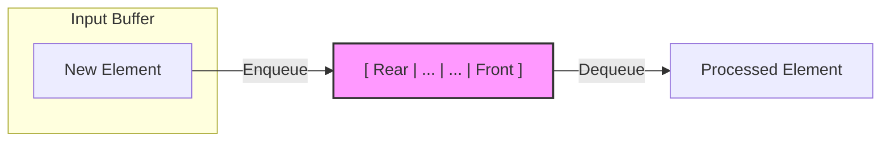

# Queue (Linear Orderings & FIFO Principles)

**Authors:**
- [Amey Thakur](https://github.com/Amey-Thakur) ([ORCID: 0000-0001-5644-1575](https://orcid.org/0000-0001-5644-1575))
- [Mega Satish](https://github.com/msatmod) ([ORCID: 0000-0002-1844-9557](https://orcid.org/0000-0002-1844-9557))

**Release Date:** January 9, 2022  
**License:** MIT License

---

## Quick Start
To execute this implementation, ensure you have Python 3.x installed and follow these steps:
```bash
python Queue.py
```

## 1. Definition
A **Queue** is a linear abstract data type (ADT) that facilitates a specific order for handling elements. It follows the **FIFO** (First-In, First-Out) principle, meaning that the first element added to the queue will be the first one to be removed.

## 2. Mathematical Explanation
A queue can be modeled as a restricted sequence or a "buffer" where elements are added at the **Rear** and removed from the **Front**.

### FIFO Axiom
For any two elements $e_1$ and $e_2$ entered into the queue at times $t_1$ and $t_2$, if $t_1 < t_2$, then $e_1$ must be removed before $e_2$.

### Formal State Representation
The state of a queue $Q$ can be represented as an ordered tuple:
$Q = (e_1, e_2, \dots, e_n)$
- **Enqueue Operation**: $Q' = (i, e_1, e_2, \dots, e_n)$ (where $i$ is added to the rear).
- **Dequeue Operation**: $Q' = (e_1, e_2, \dots, e_{n-1})$ (where $e_n$ is removed from the front).

## 3. Computer Science Theory
- **Complexity**:
    - **Time Complexity**: $O(1)$ for Enqueue, Dequeue, and Peek. This implementation uses `collections.deque` which is optimized as a doubly-linked list for constant-time additions and removals from both ends.
    - **Space Complexity**: $O(n)$ where $n$ is the number of stored elements.
- **Asynchronous Processing**: Queues are fundamental in system design for implementing message brokers, task scheduling, and handling asynchronous communication between decoupled components.

## 4. Python Implementation Logic
- **Collections Deque**: Utilizes the C-implemented `deque` from the standard library. Unlike Python lists, `deque` does not require $O(n)$ memory shifts when removing items from the beginning of the sequence.
- **Robustness**: Includes explicit capacity checks to prevent buffer overflow and raises appropriate errors for empty-state operations.

## 5. Visual Representation


