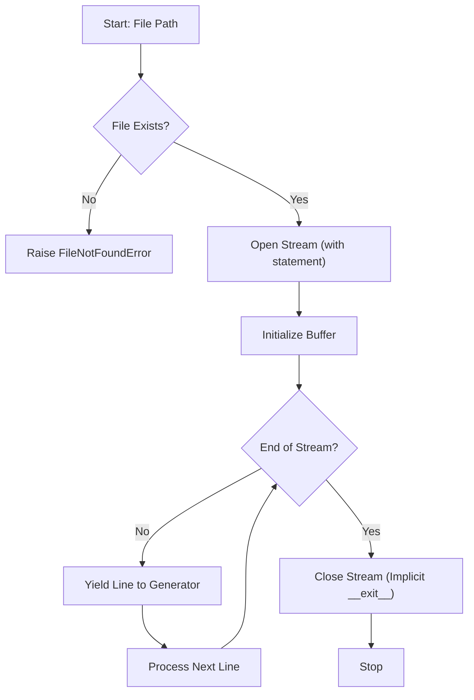

# Read File (Buffer Management & Sequential I/O Theory)

**Authors:**
- [Amey Thakur](https://github.com/Amey-Thakur) ([ORCID: 0000-0001-5644-1575](https://orcid.org/0000-0001-5644-1575))
- [Mega Satish](https://github.com/msatmod) ([ORCID: 0000-0002-1844-9557](https://orcid.org/0000-0002-1844-9557))

**Release Date:** January 9, 2022  
**License:** MIT License

---

## Quick Start
To execute this implementation, ensure you have Python 3.x installed and follow these steps:
```bash
python ReadFile.py
```

## 1. Definition
**File Reading** is the process of transferring data from a persistent storage medium (secondary memory) to the computer's primary memory (RAM). High-fidelity file operations prioritize **Deterministic Resource Deallocation**, ensuring that system file descriptors are released immediately after the operation concludes.

## 2. Mathematical Explanation
File I/O operations are primarily bottlenecked by the physical limitations of the storage device.

### Sequential Access Complexity
For a file containing $N$ bytes, the time complexity for a sequential read operation is:

$$
T(N) = O(N)
$$

The operation involves moving the read head (in magnetic drives) or iterating through memory addresses (in solid-state drives).

### Memory Efficiency (Generator Pattern)
Instead of loading the entire file into RAM, which requires $O(N)$ space, this implementation utilizes a **Generator Pattern**. By yielding one line at a time, the space complexity is reduced to:

$$
S(k) = O(k)
$$

Where $k$ is the length of the longest individual line in the file, ensuring the application can process files much larger than the available physical memory.

## 3. Computer Science Theory
- **Buffer Management**: Python's `open()` function utilizes an internal buffer to minimize the number of system calls to the OS kernel. This "buffered I/O" significantly improves performance for small, frequent reads.
- **Context Managers**: The `with` statement implements the **RAII (Resource Acquisition Is Initialization)** pattern. It guarantees that the `__exit__` method of the file object is called (closing the file), even if an unhandled exception occurs during processing.
- **Encoding Standards**: This implementation enforces `UTF-8` encoding to ensure compatibility across diverse character sets in a globalized computing environment.

## 4. Python Implementation Logic
- **Stream-Based Processing**: Uses the `yield` keyword to create an iterator, allowing for "lazy" evaluation of the file content.
- **Robust Exception Handling**: Encapsulates I/O logic in `try-except-finally` blocks (via `with`) to mitigate execution failures during concurrent file access or permission errors.

## 5. Visual Representation


