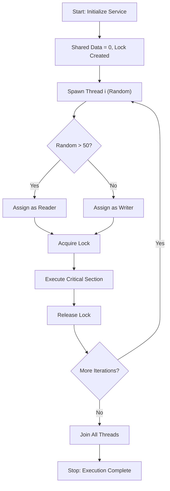

# Reader Writer (Concurrency & Mutex Synchronization)

**Authors:**
- [Amey Thakur](https://github.com/Amey-Thakur) ([ORCID: 0000-0001-5644-1575](https://orcid.org/0000-0001-5644-1575))
- [Mega Satish](https://github.com/msatmod) ([ORCID: 0000-0002-1844-9557](https://orcid.org/0000-0002-1844-9557))

**Release Date:** January 9, 2022  
**License:** MIT License

---

## Quick Start
To execute this implementation, ensure you have Python 3.x installed and follow these steps:
```bash
python ReaderWriter.py
```

## 1. Definition
The **Readers-Writers Problem** is a classical synchronization challenge in concurrent programming. It involves coordinating access to a shared resource (e.g., a database or file) between multiple "reader" threads, which only need to view the data, and "writer" threads, which need to modify it. The goal is to prevent data corruption from simultaneous writes while maximizing concurrency for reads.

## 2. Mathematical Explanation
The problem is formalized using concepts from **Process Synchronization Theory** and **Critical Section Analysis**.

### Mutual Exclusion Invariant
A mutex (mutual exclusion lock) ensures that only one thread can access the critical section at a time. Let $L$ be the lock state:

$$
L \in \{0, 1\}
$$

Where $L=1$ indicates the lock is held. A thread $T$ can only enter its critical section if $L=0$:

$$
\text{enter}(T) \implies L = 0 \land L' = 1
$$

### Concurrency Properties
This basic mutex implementation guarantees:
- **Safety**: No two threads access the critical section simultaneously.
- **Liveness**: A waiting thread will eventually acquire the lock (assuming finite hold times).

## 3. Computer Science Theory
- **Critical Section Problem**: The core challenge is to design a protocol that allows threads to safely enter and exit a shared code region. This implementation uses a lock-based approach.
- **Mutex (Mutual Exclusion)**: A synchronization primitive that prevents concurrent access. Python's `threading.Lock()` provides a simple binary semaphore for this purpose.
- **Thread Joining**: The `thread.join()` method blocks the main thread until the spawned threads complete, ensuring a clean program exit.

## 4. Python Implementation Logic
- **Lock Acquisition**: Uses `lock.acquire()` before entering the critical section and `lock.release()` after exiting, wrapped in a `try/finally` block for safety.
- **Random Thread Spawning**: Demonstrates non-deterministic scheduling by randomly assigning threads as readers or writers based on a random number generator.
- **Encapsulated State**: The `ReaderWriterService` class manages the shared data, lock, and thread list, promoting clean separation of concerns.

## 5. Visual Representation


