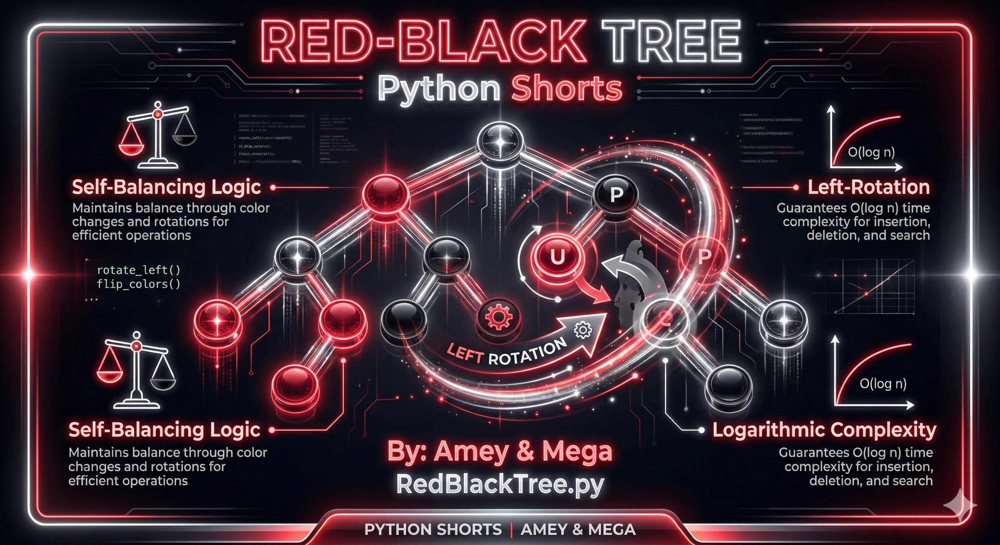
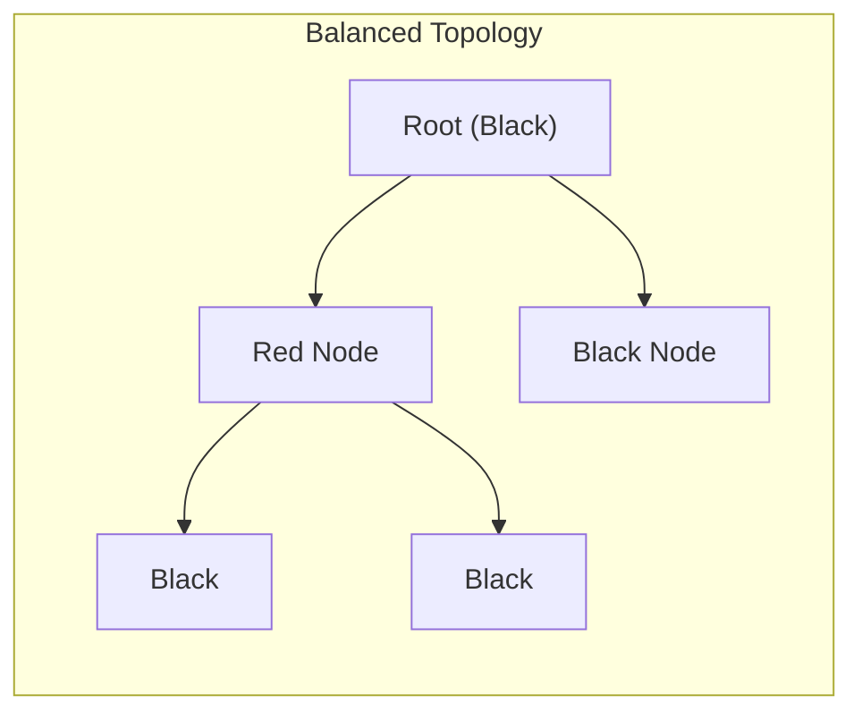
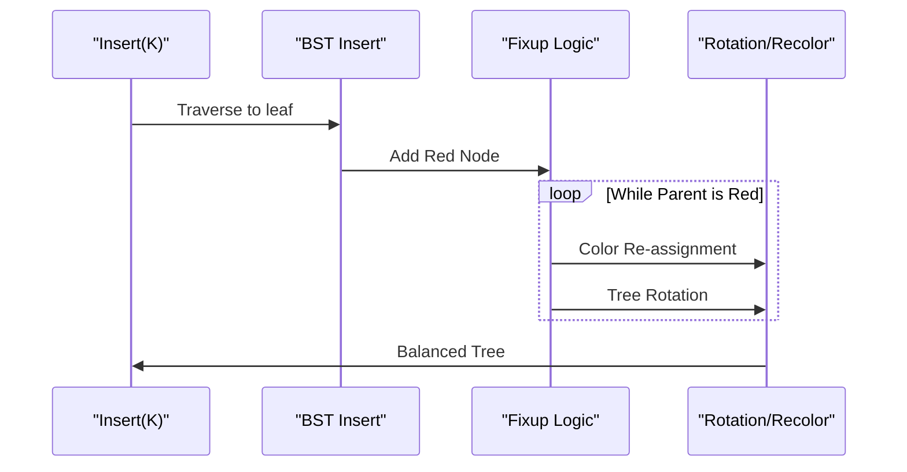

# Red-Black Tree (Self-Balancing Binary Search Tree)

**Authors:**
- [Amey Thakur](https://github.com/Amey-Thakur) ([ORCID: 0000-0001-5644-1575](https://orcid.org/0000-0001-5644-1575))
- [Mega Satish](https://github.com/msatmod) ([ORCID: 0000-0002-1844-9557](https://orcid.org/0000-0002-1844-9557))

**Release Date:** January 9, 2022  
**License:** MIT License

---

## Quick Start
To execute this implementation, ensure you have Python 3.x installed and follow these steps:
```bash
python RedBlackTree.py
```

## 1. Definition
A **Red-Black Tree** is a type of self-balancing binary search tree (BST) where each node has an extra bit for denoting the color of the node, either **red** or **black**. It ensures that no path from the root to a leaf is more than twice as long as any other path, keeping the tree height logarithmic.

## 2. Mathematical Explanation
The height $h$ of a Red-Black tree with $n$ internal nodes satisfies:

$$
h \leq 2 \log_2(n + 1)
$$

This logarithmic bound ensures that the basic dynamic-set operations such as `Search`, `Insert`, and `Delete` take $O(\log n)$ time in the worst case.

### Core Properties:
1.  **Node Coloring**: Every node is either Red or Black.
2.  **Root Property**: The root is always Black.
3.  **Leaf Property**: Every leaf (NIL) is Black.
4.  **Red Property**: If a node is Red, then both its children are Black (No two Reds in a row).
5.  **Depth Property**: For each node, all paths to descendant leaves contain the same number of Black nodes.

## 3. Computer Science Theory
- **Self-Balancing**: Prevents the tree from becoming skewed (like a linked list), which would degrade performance to $O(n)$.
- **Rotations**: Used during insertion and deletion to re-structure the tree without breaking binary search properties.
- **Recoloring**: A less computationally expensive way to restore balance before resorting to rotations.
- **Data Persistence**: Often used in implementation of associative arrays and sets in standard libraries (e.g., C++ `std::map`, Java `TreeMap`).

## 4. Python Implementation Logic
- **`RedBlackTreeService`**: Manages the root and the sentinel `nil` node.
- **Butterfly Rotations**: Implements `_left_rotate` and `_right_rotate` to balance the tree.
- **Fixup Logic**: The `_fix_insert` method handles the complex cases of parent-uncle coloring and zig-zag structure to maintain invariant properties.
- **Sentinel Nodes**: Uses a single black `nil` node for all leaf pointers to save memory and simplify edge cases.

## 5. Visual Representation

### Structural Constraints & Rotation Logic





