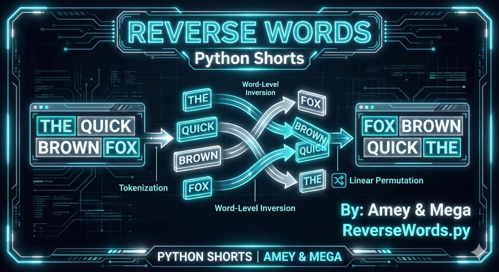
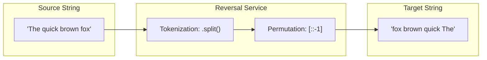
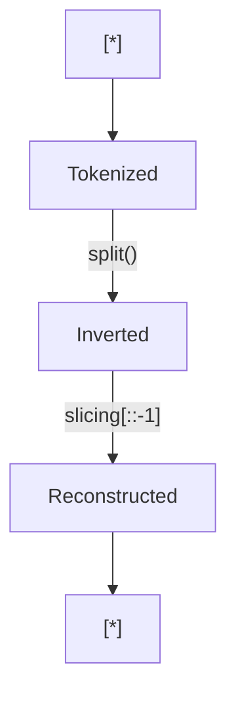

# Reverse Words (String Symmetry & Linear Permutations)

**Authors:**
- [Amey Thakur](https://github.com/Amey-Thakur) ([ORCID: 0000-0001-5644-1575](https://orcid.org/0000-0001-5644-1575))
- [Mega Satish](https://github.com/msatmod) ([ORCID: 0000-0002-1844-9557](https://orcid.org/0000-0002-1844-9557))

**Release Date:** January 9, 2022  
**License:** MIT License

---

## Quick Start
To execute this implementation, ensure you have Python 3.x installed and follow these steps:
```bash
python ReverseWords.py
```

## 1. Definition
**Word Reversal** is a linguistic string transformation process where the relative positions of words in a sentence are inverted while maintaining the internal character order of each token. This algorithm is foundational in natural language processing (NLP) tasks and text-based structural analysis.

## 2. Mathematical Explanation
The transformation can be modeled as a linear permutation of an ordered set of tokens.

### Tokenization and Permutation
Let $S$ be a string composed of $k$ tokens $W_1, W_2, \dots, W_k$. The reversal process yields a new string $S'$:

$$
S' = W_k + W_{k-1} + \dots + W_1
$$

### Complexity Analysis
For a string of length $n$ containing $k$ words:
1.  **Tokenization**: Splitting the string requires a single pass, $O(n)$.
2.  **Inversion**: Reversing the list of tokens requires $O(k)$ operations.
3.  **Reconstruction**: Joining the tokens back into a string requires $O(n)$.

The total time complexity is derived as:

$$
T(n) = O(n)
$$

The space complexity is $O(n)$ to store the intermediate token list and the result string.

## 3. Computer Science Theory
- **String Immutability**: In Python, strings are immutable. Every modification (splitting, joining) creates new objects in memory. Efficient implementations must minimize redundant allocations.
- **Delimiter Processing**: This algorithm uses whitespace as the primary delimiter, a standard approach in Western linguistic structures.
- **Stack-based Parity**: Word reversal is conceptually similar to a LIFO (Last-In, First-Out) stack operation, where tokens are pushed onto a stack and popped to achieve the reversed sequence.

## 4. Python Implementation Logic
- **Split Paradigm**: Utilizes `str.split()` to automatically handle multiple whitespace characters and produce a clean list of word tokens.
- **Slicing Syntax**: Employs Python's optimized slicing `[::-1]` for a high-performance linear-time reversal of the token list.
- **Join Synthesis**: Uses `' '.join()` to reconstruct the sentence with standardized single-space delimiters.

## 5. Visual Representation

### Structural Tokenization & Linear Permutation





