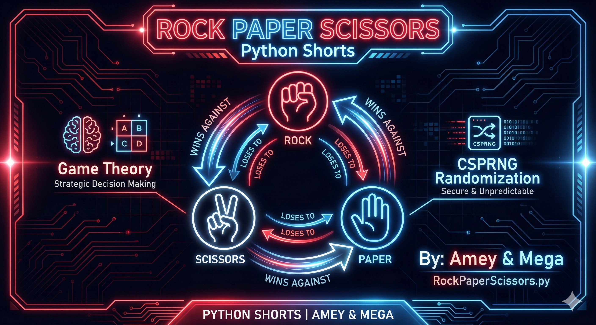
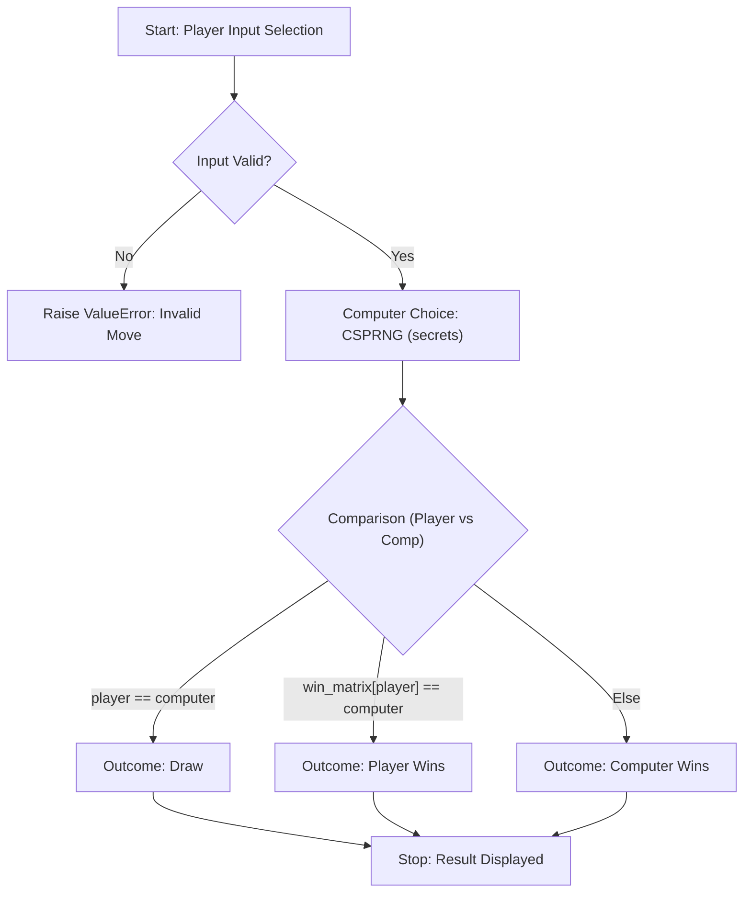
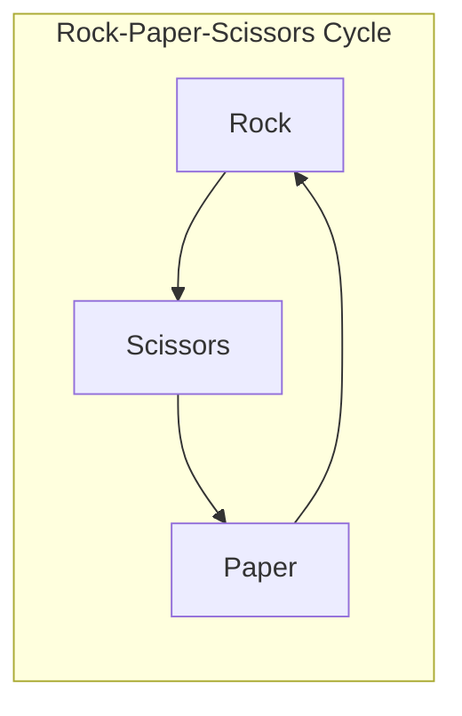

# Rock Paper Scissors (Game Theory & CSPRNG)

**Authors:**
- [Amey Thakur](https://github.com/Amey-Thakur) ([ORCID: 0000-0001-5644-1575](https://orcid.org/0000-0001-5644-1575))
- [Mega Satish](https://github.com/msatmod) ([ORCID: 0000-0002-1844-9557](https://orcid.org/0000-0002-1844-9557))

**Release Date:** January 9, 2022  
**License:** MIT License

---

## Quick Start
To execute this implementation, ensure you have Python 3.x installed and follow these steps:
```bash
python RockPaperScissors.py
```

## 1. Definition
**Rock Paper Scissors** is a simultaneous, zero-sum hand game played between two people (or a person and a computer). It is a fundamental model used in **Game Theory** to illustrate strategic decision-making and the absence of a dominant strategy in cyclic relationships.

## 2. Mathematical Explanation
In this implementation, the game is analyzed through combinatorial probability and decision matrices.

### Decision Matrix
The game can be represented as a payoff matrix where each entry $(i, j)$ represents the outcome for the first player:

| | Rock | Paper | Scissors |
| :--- | :---: | :---: | :---: |
| **Rock** | 0 | -1 | +1 |
| **Paper** | +1 | 0 | -1 |
| **Scissors** | -1 | +1 | 0 |

Where:
- $+1$: Win
- $-1$: Loss
- $0$: Tie

### Statistical Probability
Assuming a uniform distribution of moves, the probability $P$ for any outcome (Win, Loss, or Tie) for a perfectly random selection is:

$$
P = \frac{1}{3} \approx 0.333
$$

To achieve this theoretical fairness, the implementation utilizes a **Cryptographically Secure Pseudo-Random Number Generator (CSPRNG)** via the `secrets` module.

## 3. Computer Science Theory
- **CSPRNG**: Unlike standard pseudo-random generators, the `secrets` module uses OS-level entropy to generate values that are unpredictable, preventing the player from reverse-engineering the computer's move sequence.
- **Zero-Sum Mechanics**: The game represents a closed system where the gains of one player are exactly offset by the losses of the opponent.
- **Complexity**:
    - **Time Complexity**: $O(1)$. Selection and comparison take a fixed number of operations.
    - **Space Complexity**: $O(1)$ auxiliary space.

## 4. Python Implementation Logic
- **Hashing/Dictionary Mapping**: Uses dictionaries to map inputs ('R', 'P', 'S') to their full descriptions and to define the winning relationships.
- **Robust Validation**: Normalizes user input and ensures it resides within the defined search space.
- **Service Orientation**: Encapsulated within a `GameService` class to allow for integration into larger gaming architectures.

## 5. Visual Representation

### Game Theory Loop & Decision Matrix





