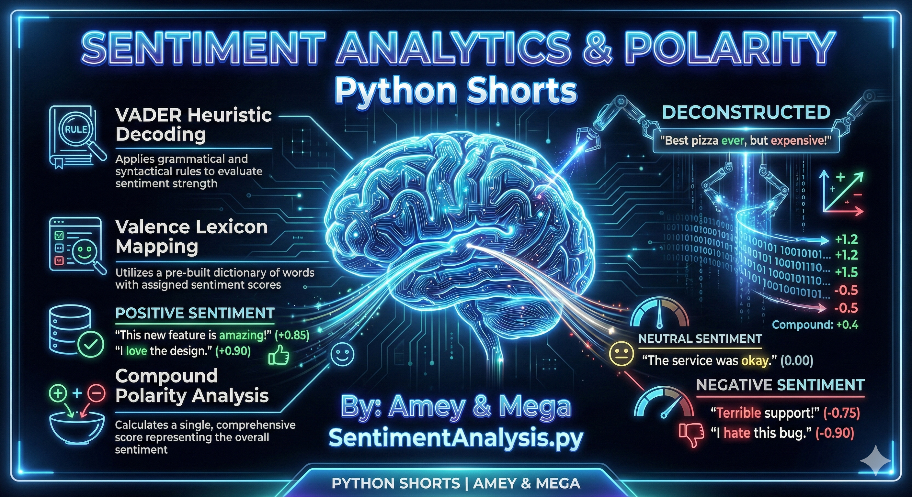
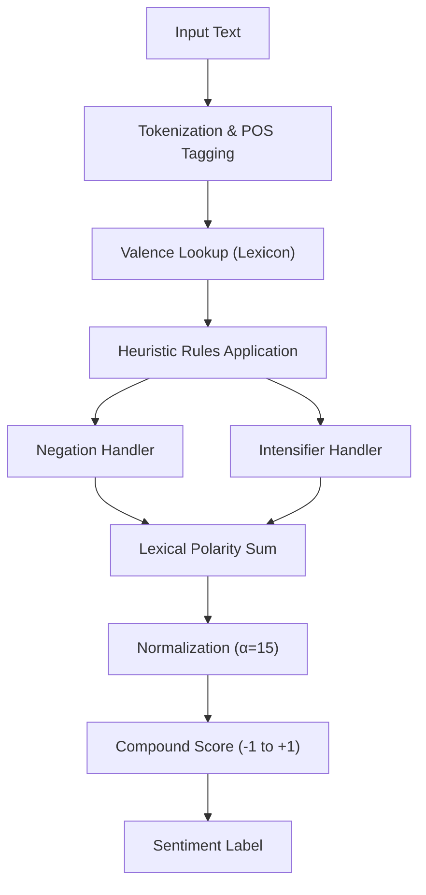

# Sentiment Analysis (Lexicon-Based Polarity Quantification)

**Authors:**
- [Amey Thakur](https://github.com/Amey-Thakur) ([ORCID: 0000-0001-5644-1575](https://orcid.org/0000-0001-5644-1575))
- [Mega Satish](https://github.com/msatmod) ([ORCID: 0000-0002-1844-9557](https://orcid.org/0000-0002-1844-9557))

**Release Date:** January 9, 2022  
**License:** MIT License

---

## Quick Start
To execute this implementation, install the required dependency and run:
```bash
pip install -r requirements.txt
python SentimentAnalysis.py
```

## 1. Definition
**Sentiment Analysis** (or Opinion Mining) is a subfield of Natural Language Processing (NLP) that involves the computational identification and categorization of opinions expressed in text. It aims to determine the writer's attitude toward a particular topic or the overall contextual polarity of a document.

## 2. Mathematical Explanation
The **Compound Score** in VADER is calculated by summing the valence scores of each word in the lexicon, adjusted according to rules, and then normalized to be between -1 (extreme negative) and +1 (extreme positive).

The normalization formula is:

$$
x_{norm} = \frac{x}{\sqrt{x^2 + \alpha}}
$$

Where:
- $x$ is the sum of the valence scores of the words.
- $\alpha$ is a constant (typically 15).

A sentence is classified as:
- **Positive**: $Score \ge 0.05$
- **Neutral**: $-0.05 < Score < 0.05$
- **Negative**: $Score \le -0.05$

## 3. Computer Science Theory
- **Lexicon-Based Approach**: Relies on a pre-built dictionary of words tagged with their emotional intensity (valence).
- **Rule-Based Heuristics**: Handles linguistic complexities that simpler bag-of-words models miss:
    - **Negation Conversion**: "not good" flips the polarity.
    - **Intensifier Adjustment**: "extremely good" increases valence intensity.
    - **Contrastive Conjunctions**: "but" often shifts the sentiment weight to the second half of the sentence.
- **VADER Performance**: Specifically tuned for social media and short-text forensics, where emojis and capitalization ("GREAT!") carry significant weight.

## 4. Python Implementation Logic
- **`SentimentAnalysisService`**: Encapsulates the NLTK `SentimentIntensityAnalyzer` for a clean, scholarly interface.
- **Resource Management**: Automatically downloads the `vader_lexicon` if missing from the local environment.
- **Polarity Mapping**: Returns a granular dictionary containing raw positive, negative, and neutral ratios alongside the normalized compound score.

## 5. Visual Representation

### Forensic Sentiment Dashboard
The analytic engine provides real-time polarity quantification across multiple linguistic dimensions.




