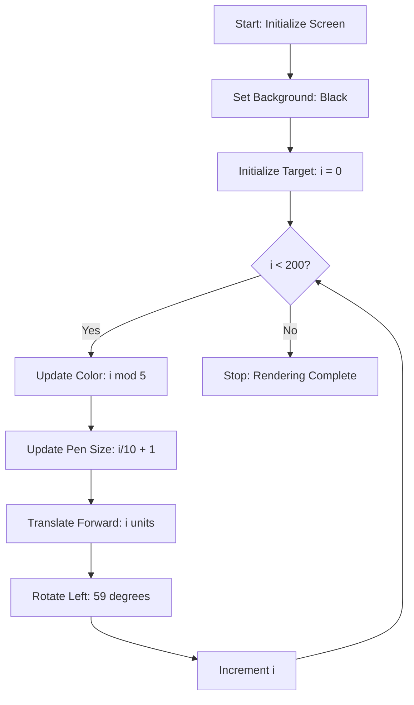

# Shape (Euclidean Geometry & Rotational Symmetry)

**Authors:**
- [Amey Thakur](https://github.com/Amey-Thakur) ([ORCID: 0000-0001-5644-1575](https://orcid.org/0000-0001-5644-1575))
- [Mega Satish](https://github.com/msatmod) ([ORCID: 0000-0002-1844-9557](https://orcid.org/0000-0002-1844-9557))

**Release Date:** January 9, 2022  
**License:** MIT License

---

## Quick Start
To execute this implementation, ensure you have Python 3.x installed and follow these steps:
```bash
python Shape.py
```

## 1. Definition
**Geometric Shape Visualization** in this implementation focuses on the generation of **Polygonal Spirals**. These are complex figures created by the iterative application of translation and rotation vectors. By slightly offsetting the rotation angle from a factor of 360, the algorithm produces a "precession" effect, resulting in a dense, multi-colored spiral structure.

## 2. Mathematical Explanation
The structure is governed by the principles of **Euclidean Coordinate Geometry** and **Discrete Rotational Symmetry**.

### Spiral Formulation
Each line segment $L_i$ in the sequence is defined by its length $s_i$ and its orientation $\theta_i$:

$$
s_i = i, \quad \theta_i = \theta_{i-1} + \alpha
$$

Where:
- $i$: The current iteration $(0 \le i < n)$.
- $\alpha$: The fixed rotation angle (e.g., $59^\circ$).

Because $59^\circ$ is not a divisor of $360^\circ$ (which would produce a closed polygon), the figure does not close, creating a spiral that expands as $i$ increases.

### Symmetry Metrics
The resulting figure exhibits a periodicity based on the modular relationship between the rotation angle and the color palette size $C$:

$$
\text{Color}(i) = C_{i \pmod 5}
$$

## 3. Computer Science Theory
- **Turtle Graphics Paradigm**: This implementation uses a "turtle-based" vector graphics engine, where a cursor (the turtle) moves in a 2D Cartesian plane according to relative commands (forward, left).
- **Iterative Transformation**: The script demonstrates an iterative approach to graphics, where complex global behavior emerges from simple, repeated local rules.
- **Resource Management**: The `turtle` library manages high-level system calls to graphical backends (like Tkinter), requiring careful cleanup of the graphics buffer and window handles.

## 4. Python Implementation Logic
- **Vector Translation**: Uses `t.forward(i)` to scale the size of each side linearly with the loop index.
- **Spectrum Cycling**: Implements modular arithmetic to cycle through a predefined list of high-contrast strings, ensuring aesthetic variety.
- **Dynamic Stroke Width**: Modifies the pen size iteratively to create a 3D structural perception within the 2D plane.

## 5. Visual Representation


