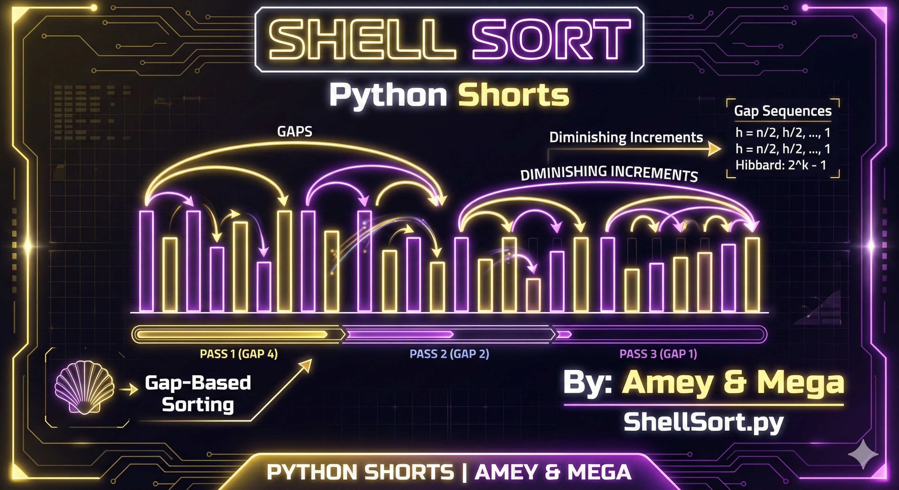
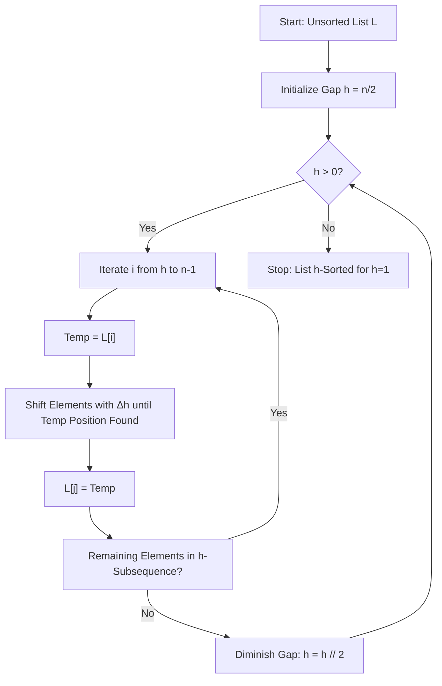
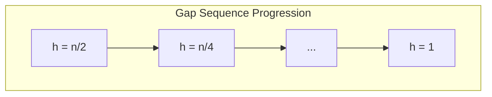

# Shell Sort (Diminishing Increments & Gap Sequences)

**Authors:**
- [Amey Thakur](https://github.com/Amey-Thakur) ([ORCID: 0000-0001-5644-1575](https://orcid.org/0000-0001-5644-1575))
- [Mega Satish](https://github.com/msatmod) ([ORCID: 0000-0002-1844-9557](https://orcid.org/0000-0002-1844-9557))

**Release Date:** January 9, 2022  
**License:** MIT License

---

## Quick Start
To execute this implementation, ensure you have Python 3.x installed and follow these steps:
```bash
python ShellSort.py
```

## 1. Definition
**Shell Sort**, developed by Donald Shell in 1959, is an in-place comparison sorting algorithm that serves as an optimization of Insertion Sort. It achieves higher efficiency by comparing and exchanging elements that are separated by a "gap," allowing out-of-place elements to move toward their final destinations faster than simple nearest-neighbor exchanges.

## 2. Mathematical Explanation
The algorithm relies on the **Diminishing Increment Gap Theory**.

### Gap Progression
A sequence of gaps $H = \{h_1, h_2, \dots, h_t\}$ is chosen. This implementation uses the original Shell sequence where $h_1 = \lfloor n/2 \rfloor$ and each subsequent gap is $h_{k+1} = \lfloor h_k/2 \rfloor$ until $h = 1$.

### Complexity Analysis
The complexity of Shell Sort is highly dependent on the chosen gap sequence.

- **Worst Case (Shell's Sequence)**: $O(n^2)$.
- **Average Case**: Generally observed between $O(n \log^2 n)$ and $O(n^{3/2})$ for common sequences.
- **Best Case**: $O(n \log n)$ for a nearly sorted array.

The space complexity remains constant:

$$
S(n) = O(1)
$$

## 3. Computer Science Theory
- **$h$-Sorted Arrays**: An array is $h$-sorted if all sub-sequences formed by taking every $h$-th element are sorted. Shell Sort transforms the array into a series of $h$-sorted states, where each state makes the subsequent $h$-sorting (with a smaller $h$) faster.
- **Improved Insertion Sort**: While standard Insertion Sort is $O(n^2)$, it is extremely fast (linear time) on partially sorted data. Shell Sort exploits this by using large gaps to partially sort the array before finishing with a standard $h=1$ insertion sort.
- **In-place Nature**: Like Insertion Sort, Shell Sort modifies the array in-place, requiring no auxiliary storage scaling with $n$.

## 4. Python Implementation Logic
- **Iterative Gap Reduction**: Uses a `while` loop to diminish the gap until the collection is fully sorted.
- **Sub-sequence Processing**: Employs nested loops to perform interleaved insertion sorts across the current gap distance.
- **Minimal Swaps**: Values are shifted rather than swapped repeatedly, reducing the number of memory write operations during each pass.

## 5. Visual Representation

### Diminishing Increments & Gap Synchronization





