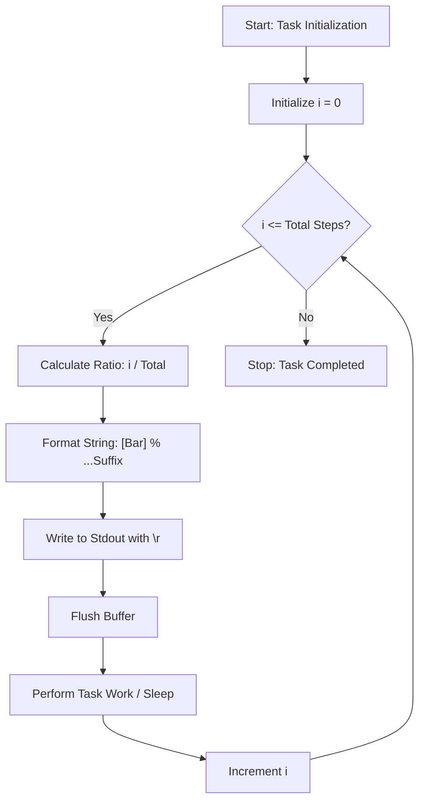

# Simple Progress Bar (Terminal I/O & Linear Interpolation)

**Authors:**
- [Amey Thakur](https://github.com/Amey-Thakur) ([ORCID: 0000-0001-5644-1575](https://orcid.org/0000-0001-5644-1575))
- [Mega Satish](https://github.com/msatmod) ([ORCID: 0000-0002-1844-9557](https://orcid.org/0000-0002-1844-9557))

**Release Date:** January 9, 2022  
**License:** MIT License

---

## Quick Start
To execute this implementation, ensure you have Python 3.x installed and follow these steps:
```bash
python SimpleProgressBar.py
```

## 1. Definition
A **Progress Bar** is a graphical control element used to visualize the progression of an extended computer operation, such as a file download or complex calculation. This implementation focuses on a terminal-based variant that utilizes ASCII characters and escape sequences to provide real-time feedback within a text-based environment.

## 2. Mathematical Explanation
The progress bar logic is grounded in **Linear Interpolation** and ratio-based mapping.

### Progress Mapping
The visual state of the bar is determined by mapping a discrete iteration count $i$ to a fixed character width $W$:

$$
L_{filled} = \text{round} \left( W \times \frac{i}{N} \right)
$$

Where:
- $i$: The current iteration index.
- $N$: The total expected iterations.
- $W$: The total visual width of the bar (e.g., 60 characters).

The completion percentage $P$ is calculated as:

$$
P = \left( \frac{i}{N} \right) \times 100
$$

## 3. Computer Science Theory
- **Terminal Buffer Management**: Standard output in terminals typically buffers data line by line. This implementation uses `sys.stdout.flush()` to bypass buffering and ensure immediate visual updates.
- **Carriage Return ($\r$)**: Unlike the newline character ($\n$), the carriage return moves the cursor back to the beginning of the current line without advancing to the next. This allows the script to overwrite the previous progress bar state, creating an animation effect.
- **Escape Sequences**: The use of $\r$ is a fundamental part of ANSI escape sequences for terminal cursor control, enabling dynamic UIs without complex graphical libraries like Tcl/Tk or Ncurses.

## 4. Python Implementation Logic
- **String Multipliers**: Leverages Python's efficient string multiplication (`'=' * n`) to construct the bar segments dynamically.
- **Format Literals**: Uses f-strings for precise alignment and formatting of the percentage and suffix data.
- **Encapsulation**: The `ProgressBarService` class manages internal state (total, length), simplifying usage in external loop-driven modules.

## 5. Visual Representation


