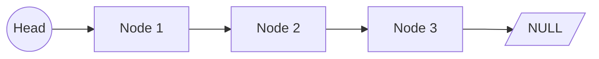
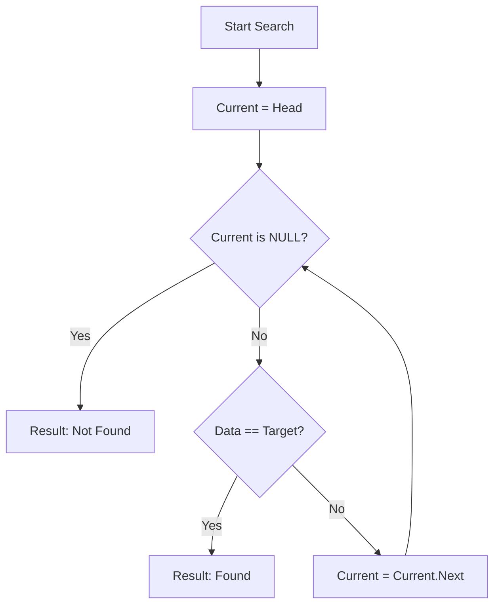

# Singly Linked List (Linear Data Structures & Dynamic Allocation)

**Authors:**
- [Amey Thakur](https://github.com/Amey-Thakur) ([ORCID: 0000-0001-5644-1575](https://orcid.org/0000-0001-5644-1575))
- [Mega Satish](https://github.com/msatmod) ([ORCID: 0000-0002-1844-9557](https://orcid.org/0000-0002-1844-9557))

**Release Date:** January 9, 2022  
**License:** MIT License

---

## Quick Start
To execute this implementation, ensure you have Python 3.x installed and follow these steps:
```bash
python SinglyLinkedList.py
```

## 1. Definition
A **Singly Linked List (SLL)** is a fundamental linear data structure in computer science. Unlike arrays, elements in a linked list are not stored in contiguous memory locations. Instead, each element (node) contains a data payload and a pointer (reference) to the subsequent node in the sequence. This structure allows for efficient insertions and deletions compared to array-based structures.

## 2. Mathematical Explanation
The properties of a Linked List are often analyzed in terms of **Asymptotic Complexity**.

### Nodes and Connectivity
Let the list be a set of nodes $N = \{n_1, n_2, \dots, n_k\}$. Each node $n_i$ is a tuple:
$$ n_i = (d_i, p_i) $$
Where:
- $d_i$: The data element.
- $p_i$: A pointer such that $p_i \to n_{i+1}$, and $p_k \to \text{NULL}$.

### Complexity Metrics
| Operation | Time Complexity | Note |
| :--- | :--- | :--- |
| **Search** | $O(n)$ | Requires sequential scan. |
| **Insert (Head)** | $O(1)$ | Constant time pointer redirection. |
| **Insert (Tail)** | $O(n)$ | Without tail pointer (standard SLL). |
| **Delete** | $O(n)$ | Requires traversal to find predecessor. |

## 3. Computer Science Theory
- **Dynamic Memory Allocation**: Linked lists grow and shrink at runtime without requiring a pre-defined contiguous block of memory.
- **Sequential Access**: Unlike arrays which support $O(1)$ random access, linked lists are strictly sequential; accessing the $i$-th element requires skipping $i-1$ predecessors.
- **Reference Semantics**: The structure relies heavily on reference handling. Proper management is required to avoid local "orphaned" nodes (memory leaks) or broken chains.

## 4. Python Implementation Logic
- **Node Encapsulation**: Uses a helper `Node` class to maintain the structure of (Data, Next).
- **Service Pattern**: The `SinglyLinkedListService` encapsulates the logic for list manipulation, keeping the implementation safe and modular.
- **Type Hinting**: Leverages `Optional['Node']` to handle the recursive nature of the structure and the terminating `None` pointer.

## 5. Visual Representation

### Linked List Structure


### Operation Flow (Search)

