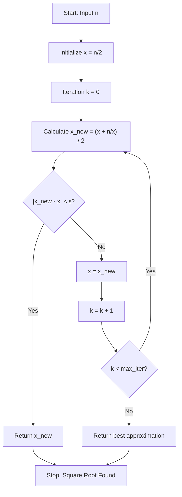

# Square Root (Newton-Raphson Method & Numerical Approximation)

**Authors:**
- [Amey Thakur](https://github.com/Amey-Thakur) ([ORCID: 0000-0001-5644-1575](https://orcid.org/0000-0001-5644-1575))
- [Mega Satish](https://github.com/msatmod) ([ORCID: 0000-0002-1844-9557](https://orcid.org/0000-0002-1844-9557))

**Release Date:** January 9, 2022  
**License:** MIT License

---

## Quick Start
To execute this implementation, ensure you have Python 3.x installed and follow these steps:
```bash
python SquareRoot.py
```

## 1. Definition
The **Square Root** of a number $n$ is a value $x$ such that $x^2 = n$. Computing square roots is a fundamental operation in numerical analysis, and this implementation uses the **Newton-Raphson Method**, an iterative root-finding algorithm with quadratic convergence.

## 2. Mathematical Explanation
The Newton-Raphson method solves the equation $f(x) = 0$ by iteratively refining an initial guess. For square roots, we solve:

$$
f(x) = x^2 - n = 0
$$

The derivative is:

$$
f'(x) = 2x
$$

The Newton-Raphson iteration formula becomes:

$$
x_{k+1} = x_k - \frac{f(x_k)}{f'(x_k)} = x_k - \frac{x_k^2 - n}{2x_k} = \frac{x_k + \frac{n}{x_k}}{2}
$$

### Convergence
The method exhibits **quadratic convergence**, meaning the number of correct digits roughly doubles with each iteration. The process terminates when:

$$
|x_{k+1} - x_k| < \epsilon
$$

where $\epsilon$ is a small tolerance value (e.g., $10^{-10}$).

## 3. Computer Science Theory
- **Iterative Approximation**: The algorithm refines an initial guess through repeated application of a formula, converging to the true value.
- **Quadratic Convergence**: Each iteration doubles the number of accurate digits, making it extremely efficient.
- **Epsilon-Delta Criterion**: Convergence is determined by comparing successive approximations against a threshold $\epsilon$.
- **Numerical Stability**: The method is stable for positive real numbers but undefined for negative inputs in real arithmetic.

## 4. Python Implementation Logic
- **Service Class**: Encapsulates the Newton-Raphson logic within `SquareRootService` for clean separation of concerns.
- **Configurable Precision**: Allows users to specify convergence tolerance and maximum iterations.
- **Error Handling**: Validates input and handles edge cases like negative numbers and zero.
- **Verification**: Demonstrates correctness by squaring the result.

## 5. Visual Representation


