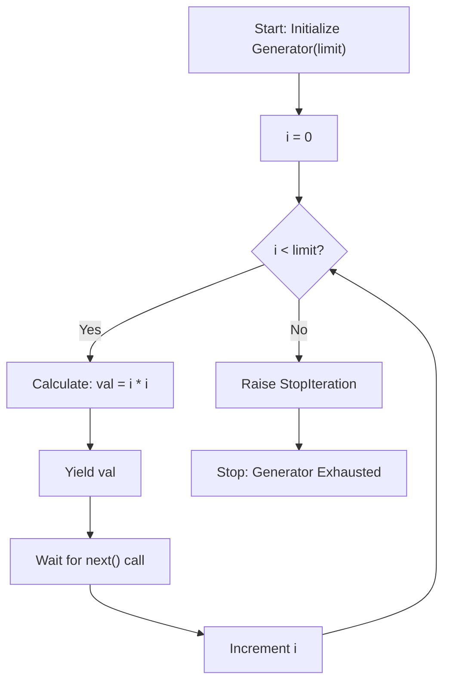

# Square of Sequence (Generators & Lazy Evaluation)

**Authors:**
- [Amey Thakur](https://github.com/Amey-Thakur) ([ORCID: 0000-0001-5644-1575](https://orcid.org/0000-0001-5644-1575))
- [Mega Satish](https://github.com/msatmod) ([ORCID: 0000-0002-1844-9557](https://orcid.org/0000-0002-1844-9557))

**Release Date:** January 9, 2022  
**License:** MIT License

---

## Quick Start
To execute this implementation, ensure you have Python 3.x installed and follow these steps:
```bash
python SquareofSequence.py
```

## 1. Definition
The **Square of Sequence** refers to a mathematical progression where each term $a_n$ is the square of its position $n$:
$$ a_n = n^2 \quad \text{for } n \in \{0, 1, 2, \dots, N-1\} $$
This implementation focuses on providing a memory-efficient way to generate these values using the **Generator** pattern.

## 2. Mathematical Explanation
The structure is a simple quadratic progression where the $i$-th element is defined by the mapping:
$$ f(i) = i^2 $$
The sequence represents the area of squares with integer side lengths, forming a fundamental series in discrete mathematics and combinatorial geometry.

## 3. Computer Science Theory
- **Generators and Iterators**: Generators in Python provide a way to implement iterators without creating the entire collection in memory. This is known as **Lazy Evaluation**.
- **The `yield` Keyword**: Unlike `return`, which terminates a function and returns a value, `yield` pauses the function, saves its state, and produces a value to the caller. The function resumes from exactly where it left off on the next `next()` call.
- **Memory Efficiency**: Since only one value is produced at a time, the space complexity is $O(1)$, making it suitable for generating extremely large or infinite sequences that would otherwise cause memory exhaustion (overflow).

## 4. Python Implementation Logic
- **Generator Method**: Implements the `yield` keyword within a loop to produce values on demand.
- **Service Pattern**: Encapsulates the generator logic within `SequenceGeneratorService` for modularity.
- **Consumption Loop**: Uses a standard `while-try-except` block to consume the generator until `StopIteration` is raised, demonstrating the underlying protocol of Python iterators.

## 5. Visual Representation


