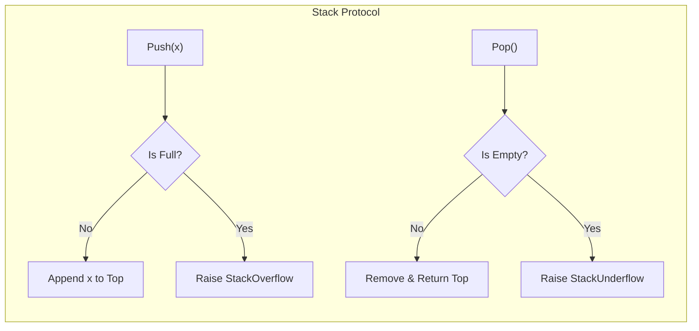
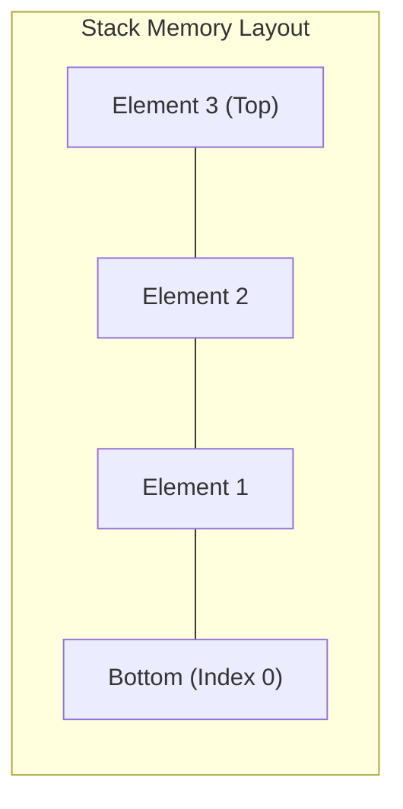

# Stack (LIFO Data Structures & Abstract Data Types)

**Authors:**
- [Amey Thakur](https://github.com/Amey-Thakur) ([ORCID: 0000-0001-5644-1575](https://orcid.org/0000-0001-5644-1575))
- [Mega Satish](https://github.com/msatmod) ([ORCID: 0000-0002-1844-9557](https://orcid.org/0000-0002-1844-9557))

**Release Date:** January 9, 2022  
**License:** MIT License

---

## Quick Start
To execute this implementation, ensure you have Python 3.x installed and follow these steps:
```bash
python Stack.py
```

## 1. Definition
A **Stack** is a linear data structure that follows the **Last-In-First-Out (LIFO)** principle. Elements are added and removed from the same end, called the "top" of the stack. It is one of the most fundamental Abstract Data Types (ADTs) in computer science, used extensively in algorithm design, memory management, and expression evaluation.

## 2. Mathematical Explanation
A stack $S$ can be modeled as an ordered sequence of elements:

$$
S = [e_1, e_2, \dots, e_n]
$$

Where $e_n$ is the top element. Operations are defined as:

- **Push(x)**: $S' = S \cup \{x\}$ at position $n+1$
- **Pop()**: Remove $e_n$, yielding $S' = [e_1, \dots, e_{n-1}]$
- **Peek()**: Return $e_n$ without modification

### Capacity Constraints
For a bounded stack with capacity $C$:

$$
|S| \leq C
$$

Attempting to push when $|S| = C$ results in **overflow**. Attempting to pop when $|S| = 0$ results in **underflow**.

## 3. Computer Science Theory
- **Abstract Data Type (ADT)**: A stack is defined by its interface (operations) rather than its implementation. It can be implemented using arrays, linked lists, or dynamic arrays.
- **LIFO Semantics**: The most recently added element is always the first to be removed, making stacks ideal for reversing sequences, backtracking, and managing function call frames.
- **Applications**:
  - **Expression Evaluation**: Converting infix to postfix notation, evaluating postfix expressions.
  - **Function Call Stack**: Managing recursion and local variable storage.
  - **Undo Mechanisms**: Storing state history in editors and applications.

## 4. Python Implementation Logic
- **List-Based Storage**: Uses Python's built-in list with `append()` for push and `pop()` for pop operations.
- **Bounded Capacity**: Enforces a maximum size to simulate real-world memory constraints.
- **Error Handling**: Provides graceful overflow/underflow messages instead of raising exceptions.
- **Service Pattern**: Encapsulates the stack logic in `StackService` for clean API design.

## 5. Visual Representation

### LIFO Mechanics & Stack Frame Dynamics





