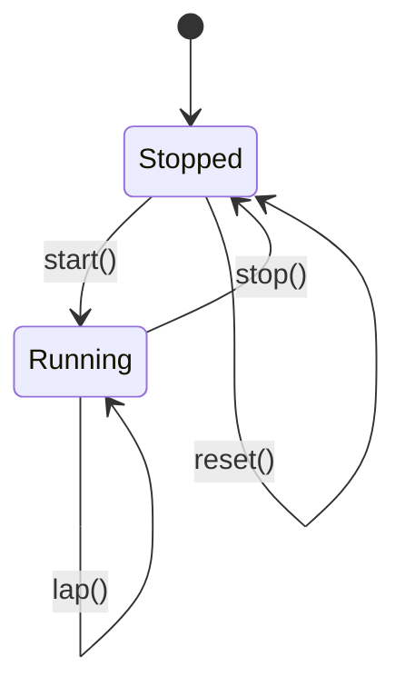
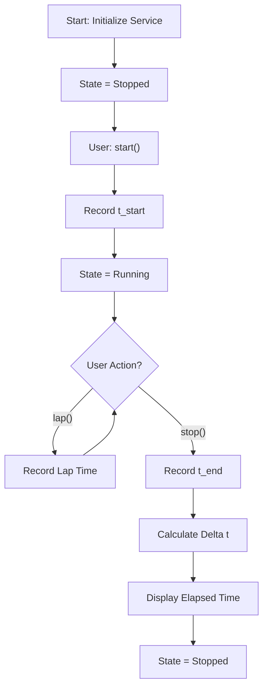

# Stop Watch (Epoch Timing & Delta Computation)

**Authors:**
- [Amey Thakur](https://github.com/Amey-Thakur) ([ORCID: 0000-0001-5644-1575](https://orcid.org/0000-0001-5644-1575))
- [Mega Satish](https://github.com/msatmod) ([ORCID: 0000-0002-1844-9557](https://orcid.org/0000-0002-1844-9557))

**Release Date:** January 9, 2022  
**License:** MIT License

---

## Quick Start
To execute this implementation, ensure you have Python 3.x installed and follow these steps:
```bash
python StopWatch.py
```

## 1. Definition
A **Stopwatch** is a timekeeping device designed to measure the amount of time elapsed from a particular starting point to a designated ending point. This implementation provides a programmatic stopwatch using system epoch time, supporting start, stop, lap, and reset functionality.

## 2. Mathematical Explanation
The stopwatch is based on **Epoch Time Measurement** and **Delta Computation**.

### Elapsed Time Calculation
The elapsed time $\Delta t$ is computed as the difference between two epoch timestamps:

$$
\Delta t = t_{end} - t_{start}
$$

Where:
- $t_{start}$: Epoch time at the start event.
- $t_{end}$: Epoch time at the stop event.

### Lap Time Computation
For lap $i$, the lap time is computed relative to the start:

$$
\text{Lap}_i = t_{lap_i} - t_{start}
$$

## 3. Computer Science Theory
- **Epoch Time**: Unix/POSIX systems measure time as seconds since January 1, 1970; Python's `time.time()` returns this as a floating-point number with sub-second precision.
- **High-Resolution Timing**: Modern systems provide microsecond or nanosecond resolution, enabling precise measurements for benchmarking and profiling applications.
- **State Machine Model**: The stopwatch operates as a finite state machine with states: `STOPPED`, `RUNNING`. Transitions occur on `start()` and `stop()` events.

## 4. Python Implementation Logic
- **Epoch Capture**: Uses `time.time()` to capture the current system time as a floating-point epoch value.
- **Optional Typing**: Employs `Optional[float]` for timestamps that may be `None` before initialization.
- **Lap Recording**: Maintains a list of lap times for multi-segment timing scenarios.
- **Configurable Precision**: Allows the user to specify decimal precision for elapsed time display.

## 5. Visual Representation




