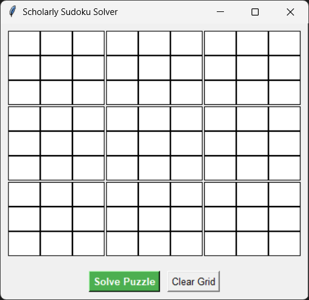
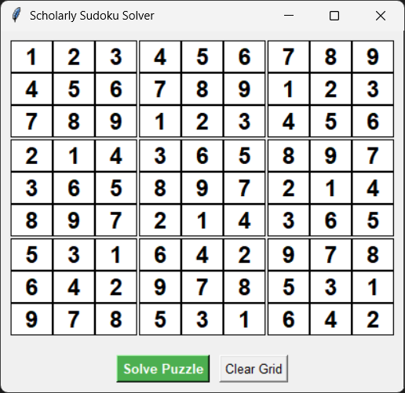
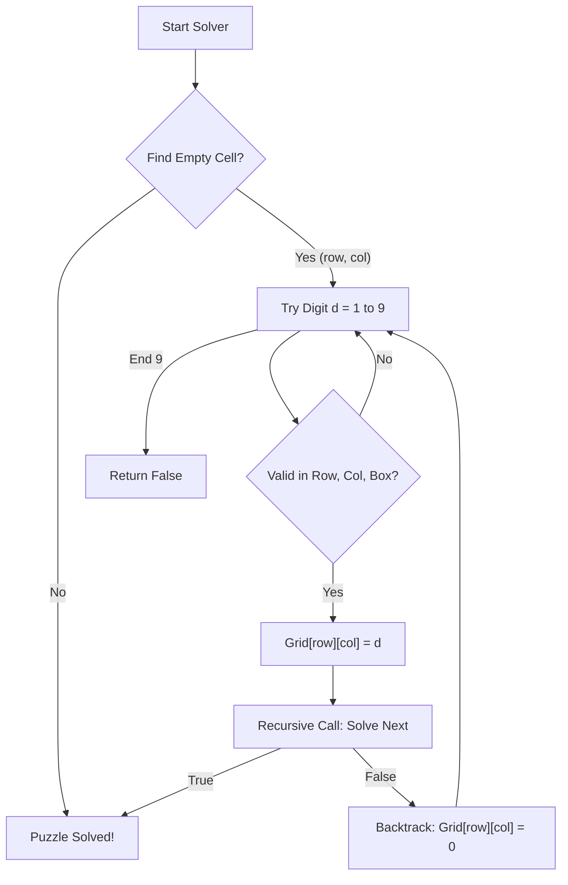
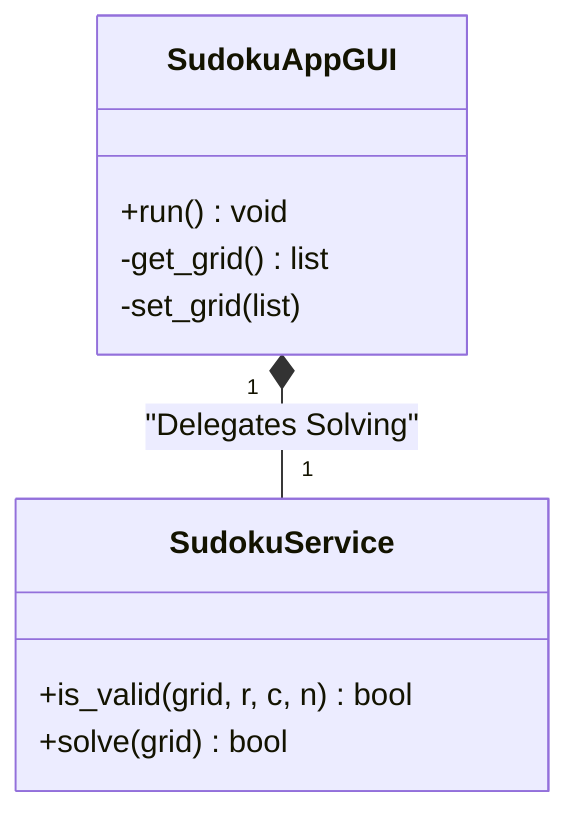

# Sudoku Solver (Backtracking & Constraint Satisfaction)

**Authors:**
- [Amey Thakur](https://github.com/Amey-Thakur) ([ORCID: 0000-0001-5644-1575](https://orcid.org/0000-0001-5644-1575))
- [Mega Satish](https://github.com/msatmod) ([ORCID: 0000-0002-1844-9557](https://orcid.org/0000-0002-1844-9557))

**Release Date:** January 9, 2022  
**License:** MIT License

---

## Quick Start
To execute this implementation, ensure you have Python 3.x installed and follow these steps:
```bash
python SudokuSolver.py
```

## 1. Definition
**Sudoku Solver** is an algorithm designed to solve 9x9 grids such that each row, column, and 3x3 subgrid contains all digits from 1 to 9. This implementation utilizes a **Backtracking Algorithm**, a depth-first search strategy for solving constraint satisfaction problems.

## 2. Mathematical Explanation
A Sudoku puzzle can be modeled as a **Constraint Satisfaction Problem (CSP)**:
- **Variables**: $X = \{x_{i,j}\}$ where $1 \leq i, j \leq 9$ (81 cells).
- **Domains**: $D = \{1, 2, ..., 9\}$.
- **Constraints**:
  - **Alldiff(Row $i$)**: All elements in row $i$ must be unique.
  - **Alldiff(Col $j$)**: All elements in column $j$ must be unique.
  - **Alldiff(Box $k$)**: All elements in the $k$-th 3x3 box must be unique.

$$
\forall i, \text{set}(x_{i,1 \dots 9}) = \{1 \dots 9\} 
$$

## 3. Computer Science Theory
- **Backtracking**: A refined brute-force approach. The algorithm builds a solution piece-by-piece and abandons a path ("backtracks") as soon as it determines that the path cannot lead to a valid solution.
- **Pruning**: By checking constraints (row, column, box) before making a recursive call, the algorithm prunes the search tree significantly.
- **Recursion**: The problem is defined in terms of itself (solve for cell $k+1$ after successfully filling cell $k$).

## 4. Python Implementation Logic
- **`SudokuService`**: Pure algorithmic class handling the recursive backtracking and validity checks.
- **`SudokuAppGUI`**: Tkinter-based user interface allowing users to input puzzles and visualize the solution.
- **Input Validation**: Ensures only numerical digits are processed.
- **Grid Highlighting**: Visual cues in the GUI to distinguish the 3x3 subgrids.

## 5. Visual Representation

### GUI Transactional Verification

| Initial Grid | Puzzle Solved |
|:------------:|:-------------:|
|  |  |




