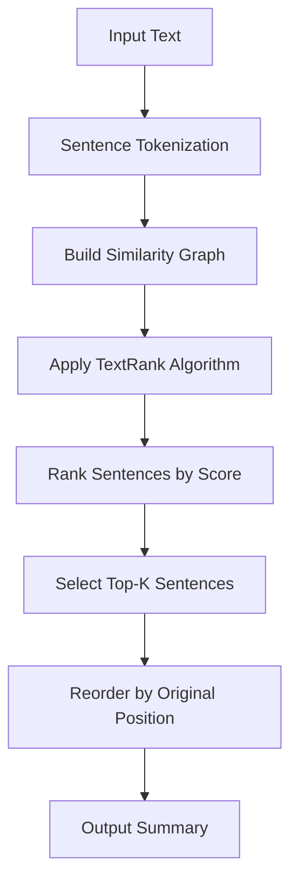
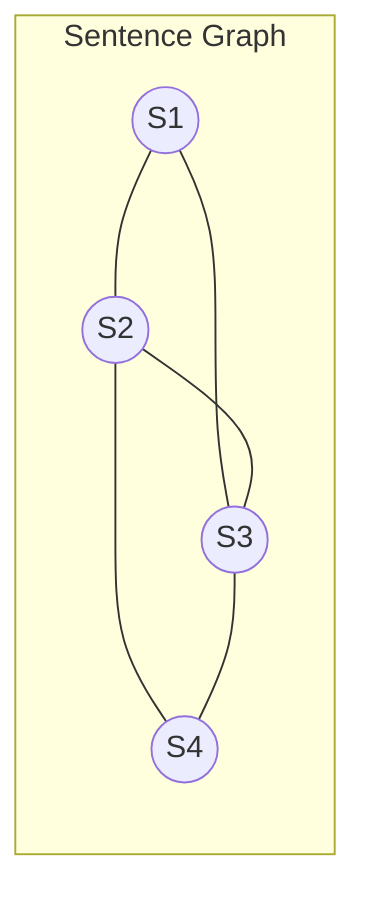

# Text Summarizer (NLP & Extractive Summarization)

**Authors:**
- [Amey Thakur](https://github.com/Amey-Thakur) ([ORCID: 0000-0001-5644-1575](https://orcid.org/0000-0001-5644-1575))
- [Mega Satish](https://github.com/msatmod) ([ORCID: 0000-0002-1844-9557](https://orcid.org/0000-0002-1844-9557))

**Release Date:** January 9, 2022  
**License:** MIT License

---

## Quick Start
To execute this implementation, ensure you have Python 3.x installed and follow these steps:
```bash
pip install sumy
python TextSummarizer.py
```

## 1. Definition
**Text Summarization** is the task of producing a concise version of a document that preserves the most important information. This implementation uses **Extractive Summarization**, which selects and concatenates the most significant sentences from the original text without generating new text.

## 2. Mathematical Explanation
The **TextRank** algorithm is based on PageRank, treating sentences as nodes in a graph. The similarity between sentences $S_i$ and $S_j$ is computed as:

$$
Similarity(S_i, S_j) = \frac{|W_i \cap W_j|}{\log(|W_i|) + \log(|W_j|)}
$$

Where $W_i$ and $W_j$ are the sets of words in each sentence. The ranking score is computed iteratively:

$$
Score(V_i) = (1-d) + d \times \sum_{V_j \in In(V_i)} \frac{w_{ji}}{\sum_{V_k \in Out(V_j)} w_{jk}} \times Score(V_j)
$$

Where:
- $d$: Damping factor (typically 0.85)
- $w_{ji}$: Edge weight (similarity) between sentences
- $In(V_i)$: Sentences linking to $V_i$

## 3. Computer Science Theory
- **Graph-Based Ranking**: Sentences are nodes; edges represent semantic similarity. PageRank identifies the most "central" sentences.
- **Extractive vs. Abstractive**: Extractive methods select existing sentences; abstractive methods generate new text (requires deep learning).
- **TF-IDF Similarity**: Term Frequency-Inverse Document Frequency measures word importance across documents.
- **Stemming & Stop Words**: Preprocessing reduces words to roots and removes common words for better similarity computation.

## 4. Python Implementation Logic
- **Service Pattern**: `TextSummarizerService` encapsulates summarization logic.
- **Sumy Library**: Modern alternative to deprecated gensim.summarization.
- **Fallback Mechanism**: Simple sentence extraction if sumy is unavailable.
- **Configurable Output**: Specify sentence count or ratio for summary length.

## 5. Visual Representation




