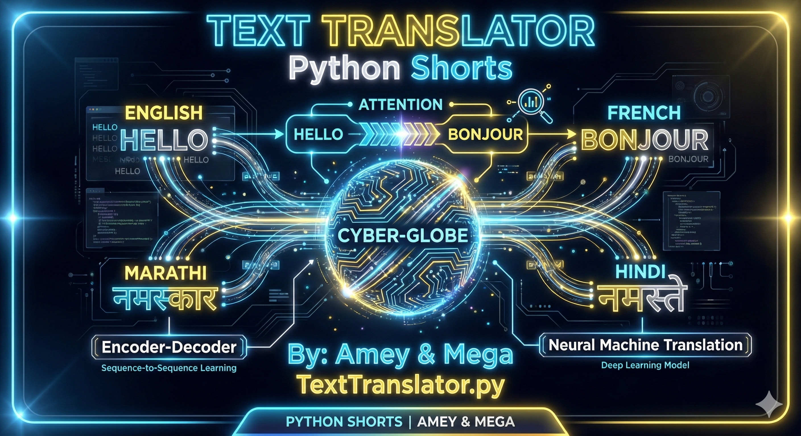
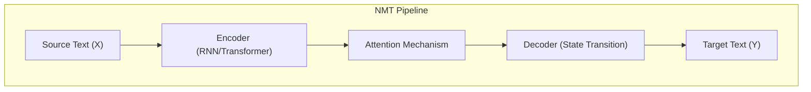
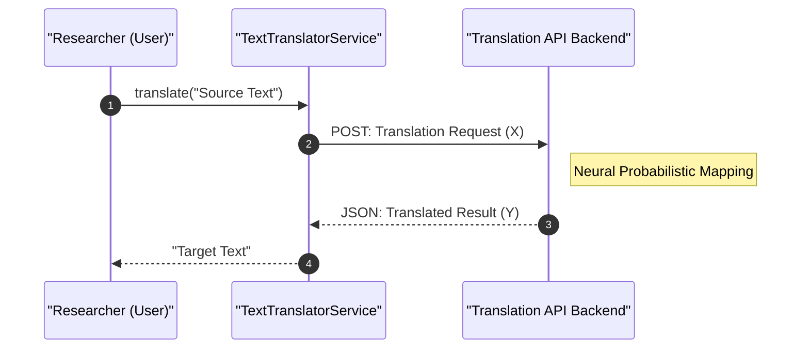

# Text Translator (Machine Translation & NLP)

**Authors:**
- [Amey Thakur](https://github.com/Amey-Thakur) ([ORCID: 0000-0001-5644-1575](https://orcid.org/0000-0001-5644-1575))
- [Mega Satish](https://github.com/msatmod) ([ORCID: 0000-0002-1844-9557](https://orcid.org/0000-0002-1844-9557))

**Release Date:** January 9, 2022  
**License:** MIT License

---

## Quick Start
To execute this implementation, ensure you have Python 3.x installed and follow these steps:
```bash
pip install translate
python TextTranslator.py
```

## 1. Definition
**Machine Translation (MT)** is the automatic conversion of text from one natural language to another. This implementation uses API-based translation services to perform cross-lingual text conversion, supporting multiple language pairs.

## 2. Mathematical Explanation
Modern neural machine translation models aim to maximize the conditional probability:

$$
P(Y|X) = \prod_{t=1}^{T} P(y_t | y_1, \dots, y_{t-1}, X)
$$

Where:
- $X$: Source sentence (sequence of words)
- $Y$: Target sentence (sequence of translated words)
- $y_t$: The $t$-th word in the target sequence

The model learns to map source language embeddings to target language embeddings through encoder-decoder architectures.

## 3. Computer Science Theory
- **Encoder-Decoder Architecture**: The source text is encoded into a fixed-length vector representation, then decoded into the target language.
- **Attention Mechanism**: Modern translators use attention to focus on relevant parts of the source sentence when generating each target word.
- **Language Codes (ISO 639-1)**: Standardized two-letter codes identify languages (e.g., 'en' for English, 'es' for Spanish).
- **API-Based Translation**: This implementation delegates translation to external services, abstracting away model complexity.

## 4. Python Implementation Logic
- **Service Pattern**: `TextTranslatorService` encapsulates translation logic with configurable language pairs.
- **Translate Library**: Uses the `translate` package for API-based translation.
- **Dynamic Language Switching**: Allows changing source/target languages at runtime.
- **Error Handling**: Gracefully handles missing dependencies and API failures.

## 5. Visual Representation

### Encoder-Decoder Attention Flow





