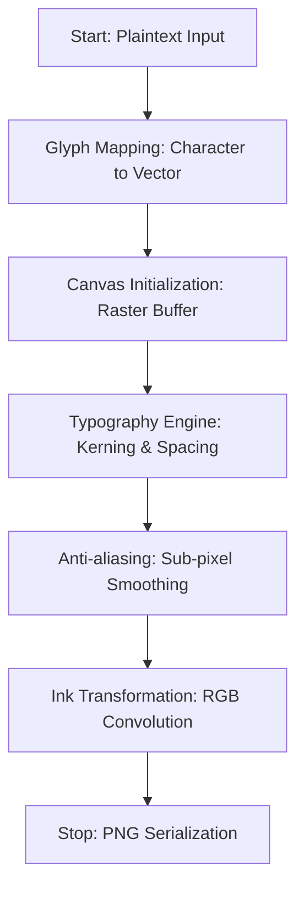
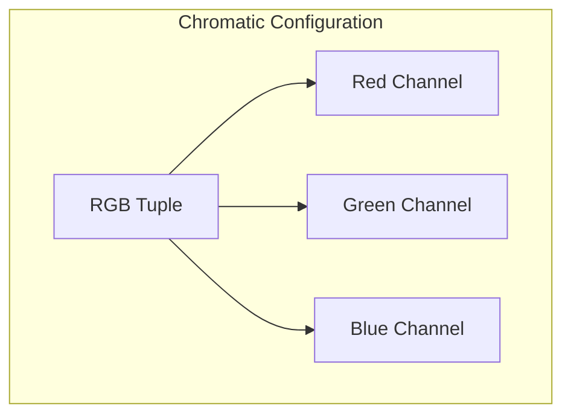

# Text to Handwriting (Image Generation & Typography)

**Authors:**
- [Amey Thakur](https://github.com/Amey-Thakur) ([ORCID: 0000-0001-5644-1575](https://orcid.org/0000-0001-5644-1575))
- [Mega Satish](https://github.com/msatmod) ([ORCID: 0000-0002-1844-9557](https://orcid.org/0000-0002-1844-9557))

**Release Date:** January 9, 2022  
**License:** MIT License

---

## Quick Start
To execute this implementation, ensure you have Python 3.x installed and follow these steps:
```bash
pip install pywhatkit
python TextToHandwriting.py
```

## 1. Definition
**Text to Handwriting** conversion transforms digital text into images that simulate handwritten content. This technique uses specialized fonts and rendering algorithms to create visually authentic handwritten representations of typed text.

## 2. Mathematical Explanation
The rendering process maps characters to glyph coordinates on a canvas:

$$
Image(x, y) = \sum_{i=1}^{n} Glyph(c_i, x_i, y_i, \theta_i)
$$

Where:
- $c_i$: The $i$-th character in the input string
- $(x_i, y_i)$: Position coordinates for each glyph
- $\theta_i$: Optional rotation/slant for natural variation

The output image dimensions are computed as:

$$
W = \sum_{i=1}^{n} width(c_i) + kerning
$$

$$
H = max(height(c_i)) + padding
$$

## 3. Computer Science Theory
- **Font Rendering**: Converts vector glyph definitions to rasterized pixel representations using anti-aliasing for smooth edges.
- **Typography**: The art and science of arranging type, including kerning (spacing between characters) and leading (line spacing).
- **PIL/Pillow**: Python Imaging Library used internally for image manipulation and text drawing.
- **RGB Color Model**: Colors are represented as tuples (R, G, B) with values 0-255 for each channel.

## 4. Python Implementation Logic
- **Service Pattern**: `TextToHandwritingService` encapsulates conversion logic with configurable colors.
- **PyWhatKit Library**: Uses the `text_to_handwriting()` function for rendering.
- **Color Presets**: Provides common ink colors for quick configuration.
- **Error Handling**: Gracefully handles missing dependencies and invalid inputs.

## 5. Visual Representation

### Handwriting Synthesis & Typography Rasterization

| Synthesized Result | Original Sample |
| :---: | :---: |
|  |  |




