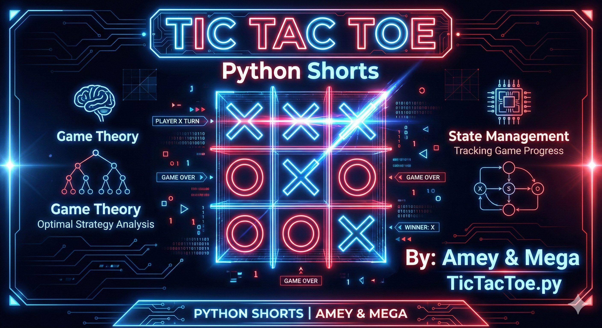
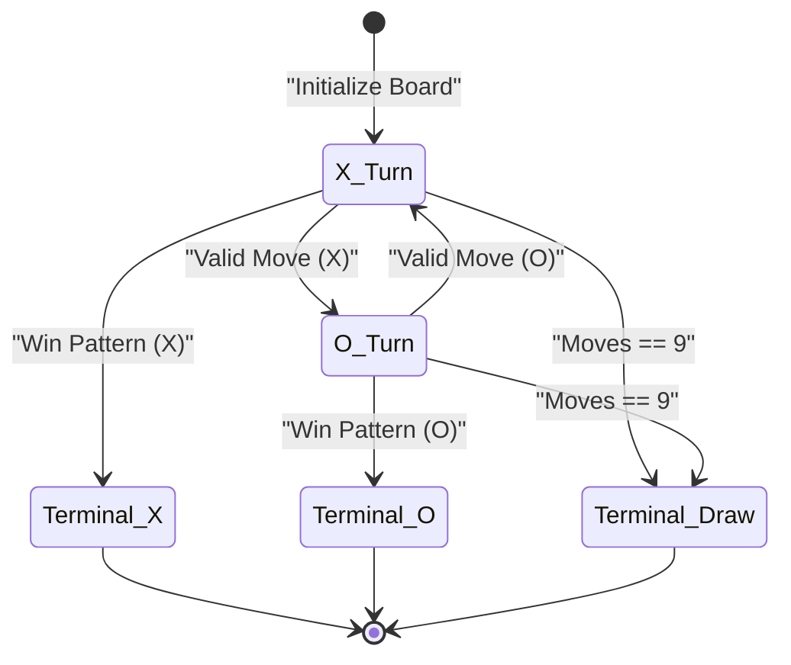
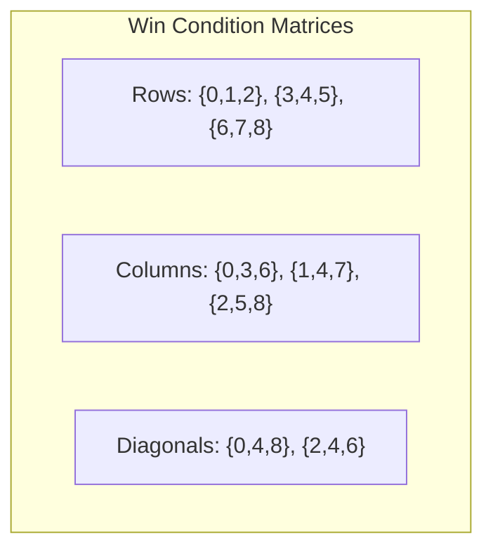

# Tic Tac Toe (Game Theory & State Management)

**Authors:**
- [Amey Thakur](https://github.com/Amey-Thakur) ([ORCID: 0000-0001-5644-1575](https://orcid.org/0000-0001-5644-1575))
- [Mega Satish](https://github.com/msatmod) ([ORCID: 0000-0002-1844-9557](https://orcid.org/0000-0002-1844-9557))

**Release Date:** January 9, 2022  
**License:** MIT License

---

## Quick Start
To execute this implementation, ensure you have Python 3.x installed and follow these steps:
```bash
python TicTacToe.py
```

## 1. Definition
**Tic Tac Toe** (also known as Noughts and Crosses) is a two-player, zero-sum game played on a 3×3 grid. Players take turns marking cells with their symbol (X or O). The first player to align three symbols horizontally, vertically, or diagonally wins.

## 2. Mathematical Explanation
The game state space can be analyzed as follows:

$$
\text{Total States} \leq 3^9 = 19,683
$$

However, accounting for game rules and symmetry:

$$
\text{Valid Game States} \approx 5,478
$$

Win conditions are checked across 8 lines:
- 3 rows: $\{(0,1,2), (3,4,5), (6,7,8)\}$
- 3 columns: $\{(0,3,6), (1,4,7), (2,5,8)\}$
- 2 diagonals: $\{(0,4,8), (2,4,6)\}$

## 3. Computer Science Theory
- **Zero-Sum Game**: One player's gain equals the other's loss; optimal play leads to a draw.
- **State Machine**: The game transitions between states based on moves, with terminal states for wins and draws.
- **Minimax Algorithm**: An optimal strategy exists that guarantees at least a draw for both players.
- **Game Tree**: The complete game tree has approximately 255,168 leaf nodes (terminal positions).

## 4. Python Implementation Logic
- **Service Pattern**: `TicTacToeService` encapsulates game state and logic.
- **Move Validation**: Prevents illegal moves (out of bounds, occupied cells).
- **Win Detection**: Checks all 8 possible winning lines after each move.
- **State Management**: Tracks current player, board state, and game-over condition.

## 5. Visual Representation

### Game Theory & State Verification





