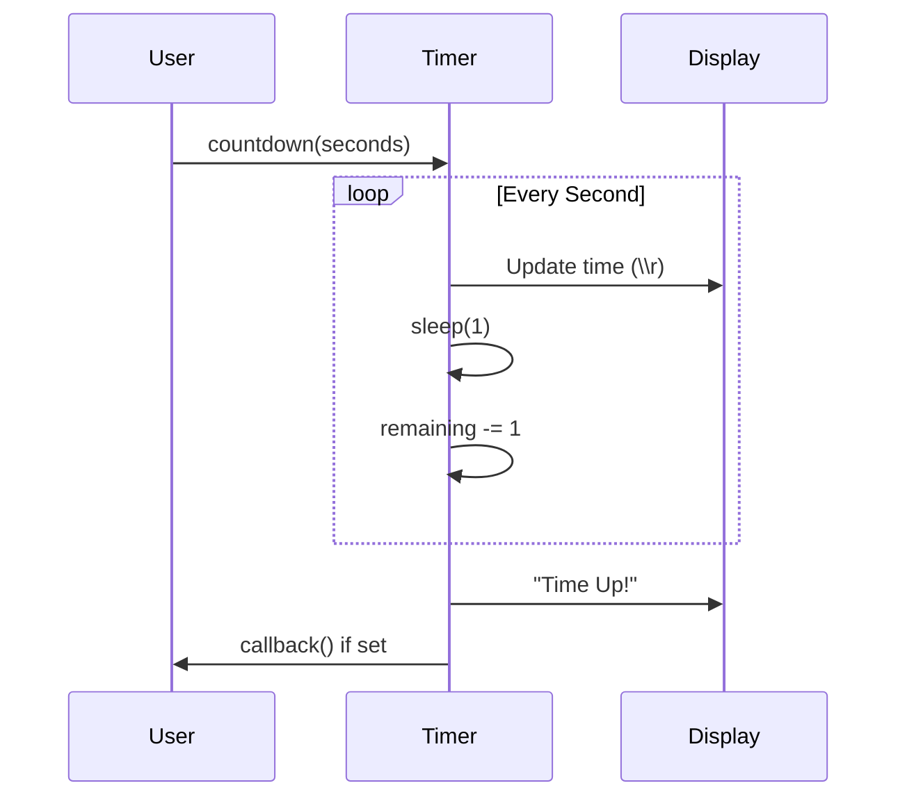
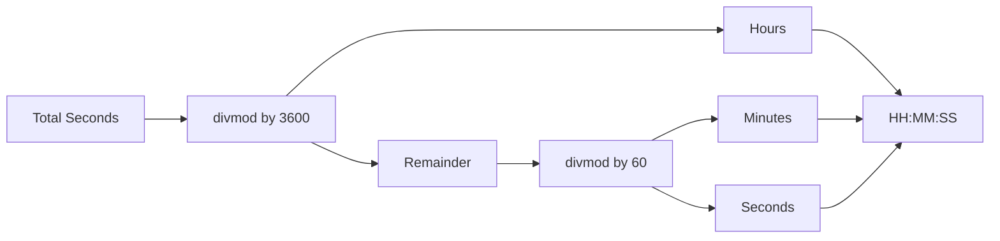

# Timer (Countdown & Time Manipulation)

**Authors:**
- [Amey Thakur](https://github.com/Amey-Thakur) ([ORCID: 0000-0001-5644-1575](https://orcid.org/0000-0001-5644-1575))
- [Mega Satish](https://github.com/msatmod) ([ORCID: 0000-0002-1844-9557](https://orcid.org/0000-0002-1844-9557))

**Release Date:** January 9, 2022  
**License:** MIT License

---

## Quick Start
To execute this implementation, ensure you have Python 3.x installed and follow these steps:
```bash
python Timer.py
```

## 1. Definition
A **Countdown Timer** is a utility that decrements a time value from a specified duration to zero. This implementation demonstrates time manipulation, terminal control sequences, and modular arithmetic for time format conversion.

## 2. Mathematical Explanation
Time conversion uses the **divmod** function for Euclidean division:

$$
(q, r) = \text{divmod}(n, d) \implies n = q \times d + r
$$

For time formatting:

$$
minutes = \lfloor \frac{seconds}{60} \rfloor
$$

$$
remaining = seconds \mod 60
$$

For hours format:

$$
hours = \lfloor \frac{seconds}{3600} \rfloor
$$

## 3. Computer Science Theory
- **Carriage Return (`\r`)**: Moves cursor to the beginning of the line, enabling in-place updates without newlines.
- **Blocking Sleep**: `time.sleep(1)` suspends execution for 1 second between updates.
- **Callback Pattern**: Optional function invocation when the timer completes.
- **Time Complexity**: O(n) where n is the number of seconds to count down.

## 4. Python Implementation Logic
- **Service Pattern**: `TimerService` encapsulates timer logic with configurable options.
- **Format Flexibility**: Supports both MM:SS and HH:MM:SS display formats.
- **Time Parsing**: Accepts input as seconds or colon-separated time strings.
- **Flush Output**: Uses `flush=True` to ensure immediate display update.

## 5. Visual Representation




