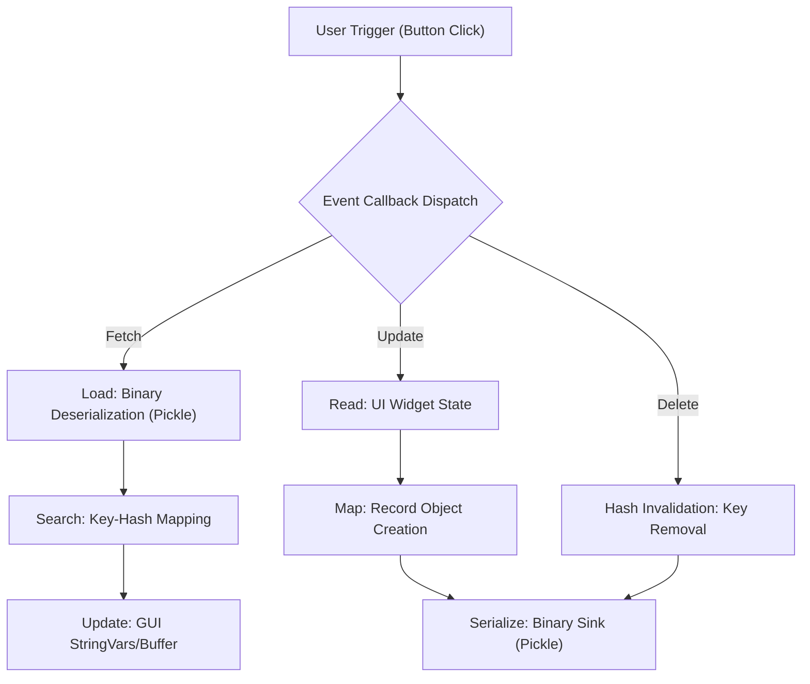
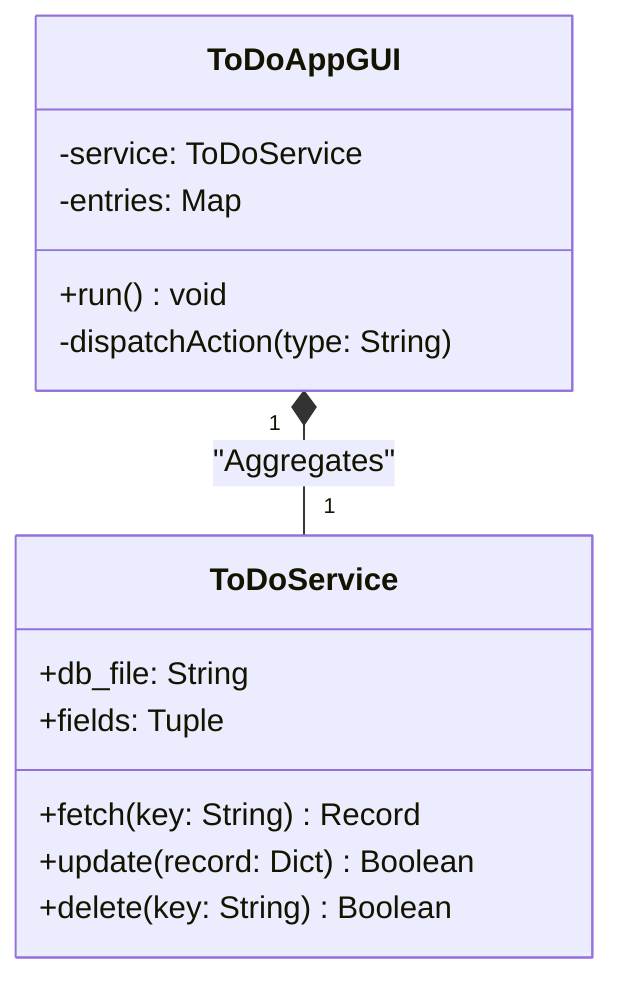

# To-Do App (GUI Programming & Data Persistence)

**Authors:**
- [Amey Thakur](https://github.com/Amey-Thakur) ([ORCID: 0000-0001-5644-1575](https://orcid.org/0000-0001-5644-1575))
- [Mega Satish](https://github.com/msatmod) ([ORCID: 0000-0002-1844-9557](https://orcid.org/0000-0002-1844-9557))

**Release Date:** January 9, 2022  
**License:** MIT License

---

## Quick Start
To execute this implementation, ensure you have Python 3.x installed and follow these steps:
```bash
python ToDoApp.py
```

> **Note**: On Ubuntu/Linux, you may need to install Tkinter: `sudo apt install python3-tk`

## 1. Definition
A **To-Do Application** is a task management utility that allows users to create, read, update, and delete (CRUD) records. This implementation uses **Tkinter** for the graphical user interface and **Pickle** for binary serialization and data persistence.

## 2. Mathematical Explanation
The data model is a key-value store implemented as a hash map:

$$
DB: K \rightarrow R
$$

Where:
- $K$: Set of unique string keys
- $R$: Set of record tuples $(key, name, description, status)$

Operations follow standard hash table complexity:
- **Fetch**: $O(1)$ average case
- **Update**: $O(1)$ average case
- **Delete**: $O(1)$ average case

## 3. Computer Science Theory
- **Event-Driven Programming**: Tkinter uses a main loop that waits for and responds to user events (button clicks, key presses).
- **Serialization (Pickle)**: Python's `pickle` module converts objects to a byte stream for storage, enabling persistent data across sessions.
- **MVC Pattern**: The implementation separates concerns with a Service layer (Model), GUI class (View), and event handlers (Controller).
- **CRUD Operations**: The four fundamental database operations—Create, Read, Update, Delete—form the basis of most data-driven applications.

## 4. Python Implementation Logic
- **Service Pattern**: `ToDoService` encapsulates all data operations, making the code testable and maintainable.
- **Tkinter Grid Layout**: Uses `grid()` geometry manager for precise widget placement.
- **Error Handling**: Provides user feedback via `messagebox` dialogs for success and error states.
- **File Initialization**: Automatically creates the database file if it doesn't exist.

## 5. Visual Representation

### Event-Driven GUI & Persistent State Management

#### Application Interface


#### Input Vector Definition


#### Transactional Update Confirmation


#### Record Retrieval (Fetch)





