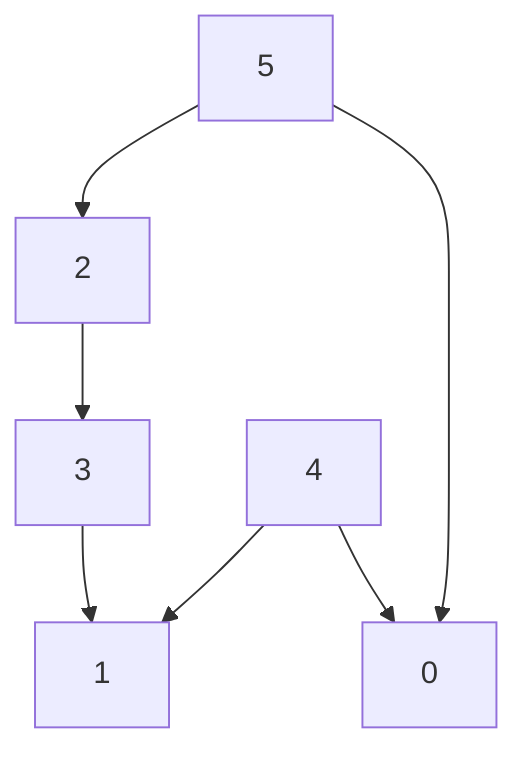
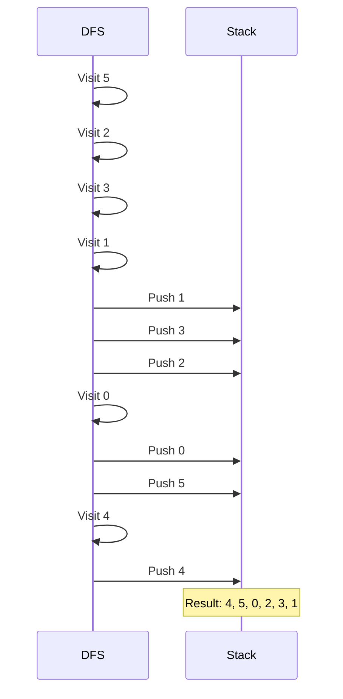

# Topological Sort (Graph Algorithms & DAG)

**Authors:**
- [Amey Thakur](https://github.com/Amey-Thakur) ([ORCID: 0000-0001-5644-1575](https://orcid.org/0000-0001-5644-1575))
- [Mega Satish](https://github.com/msatmod) ([ORCID: 0000-0002-1844-9557](https://orcid.org/0000-0002-1844-9557))

**Release Date:** January 9, 2022  
**License:** MIT License

---

## Quick Start
To execute this implementation, ensure you have Python 3.x installed and follow these steps:
```bash
python TopologicalSort.py
```

## 1. Definition
**Topological Sort** is a linear ordering of vertices in a Directed Acyclic Graph (DAG) such that for every directed edge $(u, v)$, vertex $u$ comes before $v$ in the ordering. It is used for task scheduling, dependency resolution, and build systems.

## 2. Mathematical Explanation
For a DAG $G = (V, E)$, a topological ordering is a bijection $\pi: V \rightarrow \{1, 2, ..., |V|\}$ such that:

$$
\forall (u, v) \in E: \pi(u) < \pi(v)
$$

Properties:
- A graph has a topological ordering **if and only if** it is a DAG.
- The number of distinct topological orderings can be computed using the graph's structure.
- DFS-based algorithm runs in $O(V + E)$ time.

## 3. Computer Science Theory
- **Directed Acyclic Graph (DAG)**: A directed graph with no cycles; prerequisite for topological sort.
- **Depth-First Search (DFS)**: Traversal algorithm that explores as far as possible before backtracking.
- **Post-Order Insertion**: Vertices are added to the result after all their descendants are processed.
- **Cycle Detection**: Uses recursion stack to detect back edges indicating cycles.

## 4. Python Implementation Logic
- **Service Pattern**: `TopologicalSortService` encapsulates graph operations and sorting logic.
- **Adjacency List**: Efficient graph representation using dictionary of lists.
- **DFS with Cycle Detection**: Returns None if a cycle is detected, making the sort impossible.
- **Stack-Based Result**: Uses list insertion at front to build correct order.

## 5. Visual Representation

### Sample Graph


### DFS Traversal Process


### Topological Order
```
5 -> 4 -> 2 -> 3 -> 1 -> 0
```
(One valid ordering; others may also be valid)
