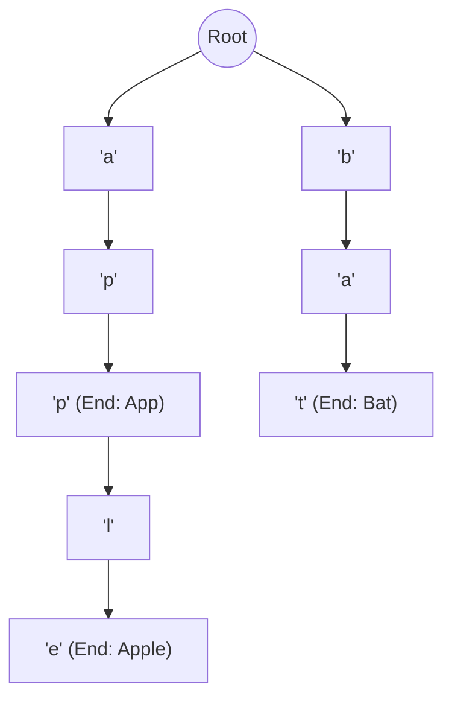
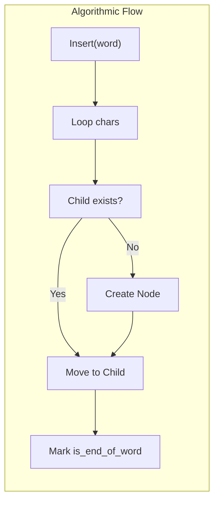

# Trie (Prefix Tree & Retrieval-Based Optimization)

**Authors:**
- [Amey Thakur](https://github.com/Amey-Thakur) ([ORCID: 0000-0001-5644-1575](https://orcid.org/0000-0001-5644-1575))
- [Mega Satish](https://github.com/msatmod) ([ORCID: 0000-0002-1844-9557](https://orcid.org/0000-0002-1844-9557))

**Release Date:** January 9, 2022  
**License:** MIT License

---

## Quick Start
To execute this implementation, ensure you have Python 3.x installed and follow these steps:
```bash
python Trie.py
```

## 1. Definition
A **Trie**, derived from the word "re**trie**val", is a specialized tree-based data structure used for storing associative arrays where the keys are usually strings. Unlike a standard binary search tree, no node in the Trie stores the key associated with that node; instead, its position in the tree defines the key with which it is associated.

## 2. Mathematical Explanation
Let $S$ be a set of strings. A Trie representing $S$ is a rooted tree where each edge is labeled with a character $c \in \Sigma$ (alphabet). For any node $u$, the path from the root to $u$ defines a prefix $P(u)$.

The space complexity is bounded by:

$$
Space \approx O(\text{Total length of all strings})
$$

The time complexity for insertion and search is:

$$
T(L) = O(L)
$$

where $L$ is the length of the string, making it independent of the number of strings stored in the data structure.

## 3. Computer Science Theory
- **Prefix Matching**: Perfect for applications like IP routing, predictive text, and auto-complete.
- **Ordered Alphabet**: Nodes can be traversed in alphabetical order using Depth-First Search (DFS).
- **Space Efficiency**: Common prefixes are stored only once, saving significant memory for large datasets with shared stems (e.g., "dictionary", "dictate", "dictation").
- **Radix Tree Comparison**: A Trie is a type of Radix Tree with a radix of 1 (every node represents exactly one character).

## 4. Python Implementation Logic
- **`TrieNode`**: Uses a dictionary (`Dict[str, TrieNode]`) for constant-time child lookups.
- **`TrieService`**: Encapsulates the core algorithmic logic for insertion, exact search, and prefix search.
- **Autocomplete**: Implements a DFS-based traversal starting from the prefix terminal node to collect all possible word completions.
- **Recursive Traversal**: The `_dfs` method builds full words by tracking the path from the prefix down to terminal nodes mark as `is_end_of_word`.

## 5. Visual Representation

### Prefix Pathing & Shared Stems





