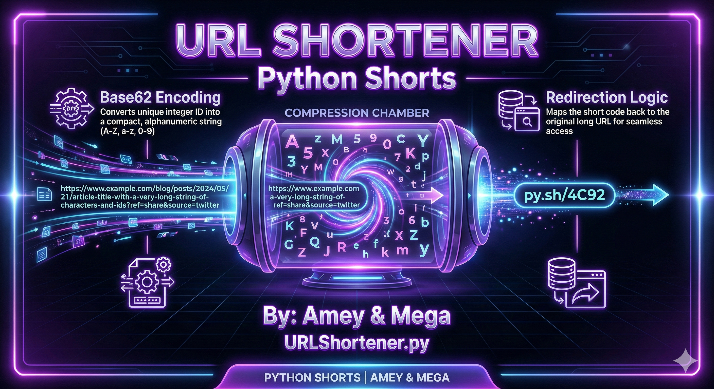
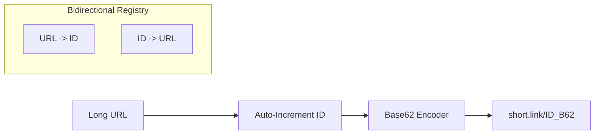
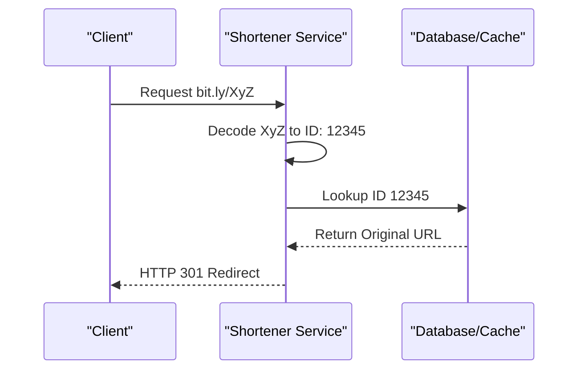

# URL Shortener (Base62 Encoding & Persistent Mapping)

**Authors:**
- [Amey Thakur](https://github.com/Amey-Thakur) ([ORCID: 0000-0001-5644-1575](https://orcid.org/0000-0001-5644-1575))
- [Mega Satish](https://github.com/msatmod) ([ORCID: 0000-0002-1844-9557](https://orcid.org/0000-0002-1844-9557))

**Release Date:** January 9, 2022  
**License:** MIT License

---

## Quick Start
To execute this implementation, ensure you have Python 3.x installed and follow these steps:
```bash
python URLShortener.py
```

## 1. Definition
A **URL Shortener** is a service that translates long URLs into much shorter, more manageable strings. This is typically achieved by assigning a unique numeric ID to each URL and then representing that ID in a higher-base number system (Base62) to minimize string length.

## 2. Mathematical Explanation
**Base62** uses 62 distinct characters: `[0-9]`, `[a-z]`, and `[A-Z]`. By converting an auto-incrementing database ID into Base62, we can represent massive quantities of URLs with very few characters.

The number of combinations $C$ for a short URL of length $L$ is:

$$
C = 62^L
$$

| Length (L) | Possible Combinations |
|------------|-----------------------|
| 5          | 916,132,832           |
| 6          | 56,800,235,584        |
| 7          | 3,521,614,606,208     |

## 3. Computer Science Theory
- **Hashing vs. Indexing**: Unlike hashing (which can have collisions), using an auto-incrementing ID guarantees uniqueness.
- **Bijective Mapping**: The transformation from ID to Base62 string and back is a one-to-one correspondence (bijection), ensuring that every short URL resolves to exactly one long URL.
- **Caching & Latency**: In production systems, short URL lookups are frequently cached in high-speed memory stores (like Redis) since the mapping is immutable.
- **Redirection (HTTP 301/302)**: The final step of a shortener service is sending an HTTP redirect header to the client's browser.

## 4. Python Implementation Logic
- **`URLShortenerService`**: Encapsulates the bidirectional dictionary mappings and the Base62 encoding engine.
- **Base62 Character Map**: Uses `0-9`, `a-z`, `A-Z` for a total of 62 collision-resistant symbols.
- **Expansion Logic**: Recovers the original integer ID from the Base62 string using positional numeral system arithmetic before looking it up in the `id_to_url` registry.
- **Aesthetics**: Starts counter at `10000` to ensure short URLs have a consistent, professional-length suffix from the start.

## 5. Visual Representation

### Encoding Pipeline & Resolution Workflow





