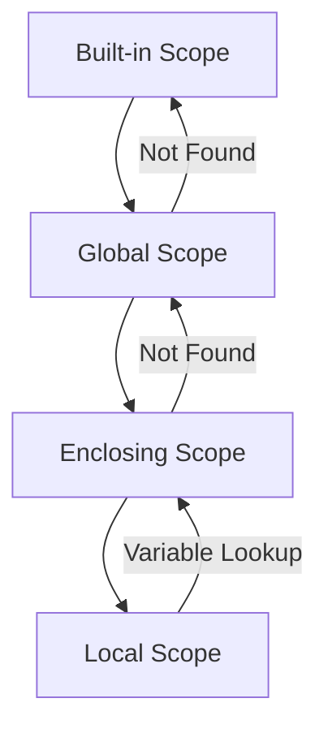
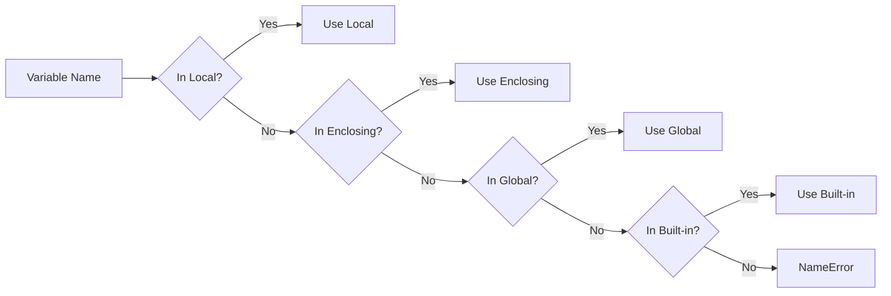

# Variable Scope (LEGB Rule & Namespaces)

**Authors:**
- [Amey Thakur](https://github.com/Amey-Thakur) ([ORCID: 0000-0001-5644-1575](https://orcid.org/0000-0001-5644-1575))
- [Mega Satish](https://github.com/msatmod) ([ORCID: 0000-0002-1844-9557](https://orcid.org/0000-0002-1844-9557))

**Release Date:** January 9, 2022  
**License:** MIT License

---

## Quick Start
To execute this implementation, ensure you have Python 3.x installed and follow these steps:
```bash
python VariableScope.py
```

## 1. Definition
**Variable Scope** defines the region of a program where a variable is accessible. Python uses the **LEGB Rule** to resolve variable names: Local → Enclosing → Global → Built-in. Understanding scope prevents naming conflicts and unintended side effects.

## 2. Mathematical Explanation
Scope resolution can be modeled as a search through nested namespaces:

$$
resolve(name) = first(N_L, N_E, N_G, N_B)
$$

Where:
- $N_L$: Local namespace (current function)
- $N_E$: Enclosing namespace (outer functions)
- $N_G$: Global namespace (module level)
- $N_B$: Built-in namespace (Python built-ins)

The function returns the first namespace containing the name.

## 3. Computer Science Theory
- **Namespace**: A mapping from names to objects (implemented as dictionaries in Python).
- **Lexical Scoping**: Scope is determined by the physical location of code in the source file.
- **global Keyword**: Declares that a variable refers to the global scope.
- **nonlocal Keyword**: Declares that a variable refers to the enclosing scope.
- **Shadowing**: A local variable can "shadow" a variable with the same name in an outer scope.

## 4. Python Implementation Logic
- **Local Scope**: Variables assigned inside a function are local by default.
- **Enclosing Scope**: Accessed via `nonlocal` in nested functions.
- **Global Scope**: Accessed via `global` keyword or direct module-level access.
- **Built-in Scope**: Contains `print()`, `len()`, `range()`, and other Python functions.

## 5. Visual Representation

### LEGB Hierarchy


### Namespace Resolution


### Scope Hierarchy Example
```
Built-in:  print, len, range, int, str...
    │
Global:    global_var = "Original"
    │
Enclosing: def outer():
    │          enclosing_var = "Enclosing"
    │
Local:         def inner():
                   local_var = "Local"
```
