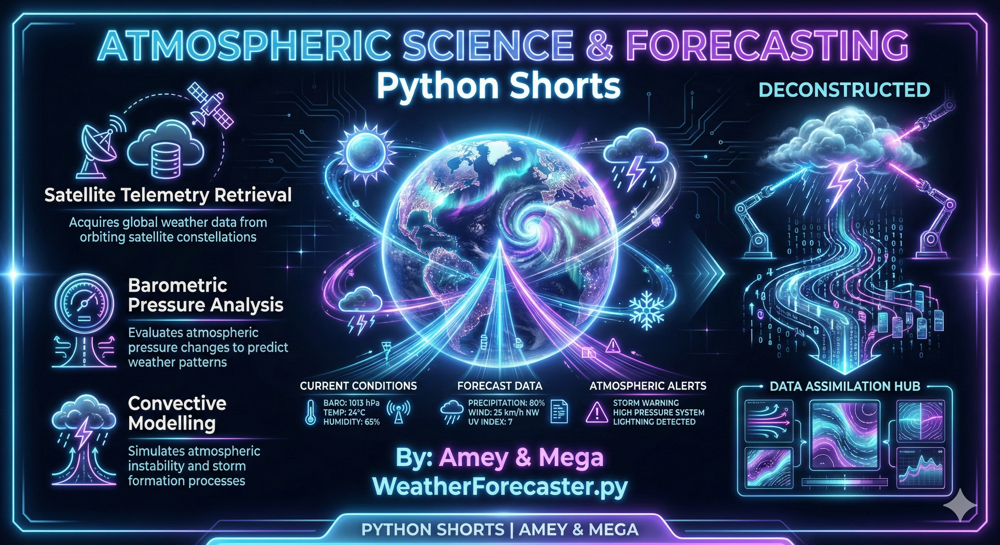
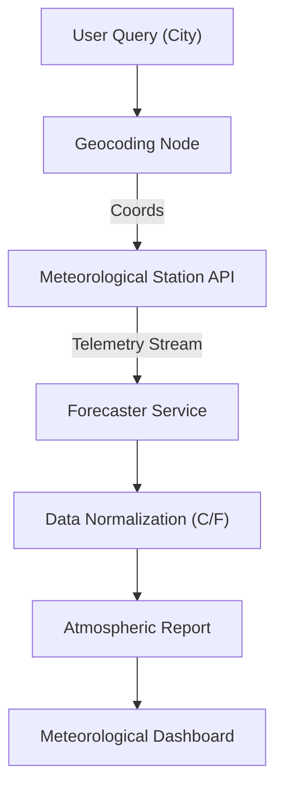

# Weather Forecaster (Meteorological Science & Remote Sensing)

**Authors:**
- [Amey Thakur](https://github.com/Amey-Thakur) ([ORCID: 0000-0001-5644-1575](https://orcid.org/0000-0001-5644-1575))
- [Mega Satish](https://github.com/msatmod) ([ORCID: 0000-0002-1844-9557](https://orcid.org/0000-0002-1844-9557))

**Release Date:** January 9, 2022  
**License:** MIT License

---

## Quick Start
To execute this implementation, install the required dependency and run:
```bash
pip install -r requirements.txt
python WeatherForecaster.py
```

## 1. Definition
A **Weather Forecaster** is a meteorological application that integrates atmospheric data from remote sensors and satellite telemetry to predict future environmental states. In a computational context, this requires parsing complex environmental vectors (temperature, humidity, velocity) into actionable insights.

## 2. Technical Explanation
Meteorological data retrieval relies on the **JSON-based REST API** architecture of global weather stations. The primary parameters include:
- **Convective Available Potential Energy (CAPE)**: Stability of the atmosphere.
- **Barometric Pressure ($P$)**: Measured in Hectopascals (hPa), indicating high or low-pressure systems.
- **Dew Point**: The temperature at which air becomes saturated.

### Coordinate Mapping
The system uses **Reverse Geocoding** to map urban node names (e.g., Tokyo) to precise global coordinates:
$$
\text{Coordinate} = (\text{Latitude}_{\phi}, \text{Longitude}_{\lambda})
$$

## 3. Computer Science Theory
- **Temporal Resolution**: The frequency at which sensors update (e.g., every 15 minutes). The forecaster must manage cache states to avoid redundant API polling.
- **Serialization (JSON)**: Deconstructing nested responses from weather providers into local atmospheric objects.
- **Fault Tolerance**: Implementing fallback scenarios for when a specific ground station is offline.

## 4. Python Implementation Logic
- **`WeatherForecasterService`**: A modular climate engine using `requests` for data harvesting.
- **Metric Normalization**: Automatically converts raw scientific data (Kelvin) into human-readable Metric (Celsius) or Imperial units.
- **Weather State Mapping**: Translates numerical condition codes (e.g., 200) into descriptive states (e.g., "Thunderstorm with light rain").

## 5. Visual Representation

### Atmospheric Data Pipeline
The analytic engine retrieves and visualizes global weather parameters via high-fidelity satellite streams.



> [!TIP]
> **High-Fidelity Prompt for Gemini:**
> *A high-fidelity, high-tech neon infographic for a Weather Forecaster engine, titled 'ATMOSPHERIC SCIENCE & FORECASTING' with 'Python Shorts' secondary title. The design should be in a sleek dark mode with vibrant neon sky blue, thunderstorm violet, and silver accents. It should feature a large 3D glowing holographic Earth in the center with pulsing weather icons (sun, storm clouds, snowflakes) floating around it. From the earth, show digital radar streams 'BEAMING' out, containing barometric and temperature data points. Show a storm system being 'DECONSTRUCTED' into atmospheric data vectors. Include technical labels for 'Satellite Telemetry Retrieval', 'Barometric Pressure Analysis', and 'Convective Modelling'. Include the text 'By: Amey & Mega' and 'WeatherForecaster.py' prominently. At the bottom, include a professional footer 'PYTHON SHORTS | AMEY & MEGA'. The overall look should be premium, technical, and visually stunning.*


