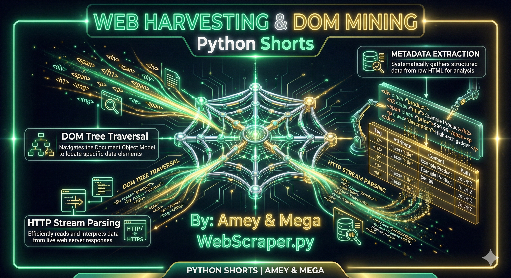
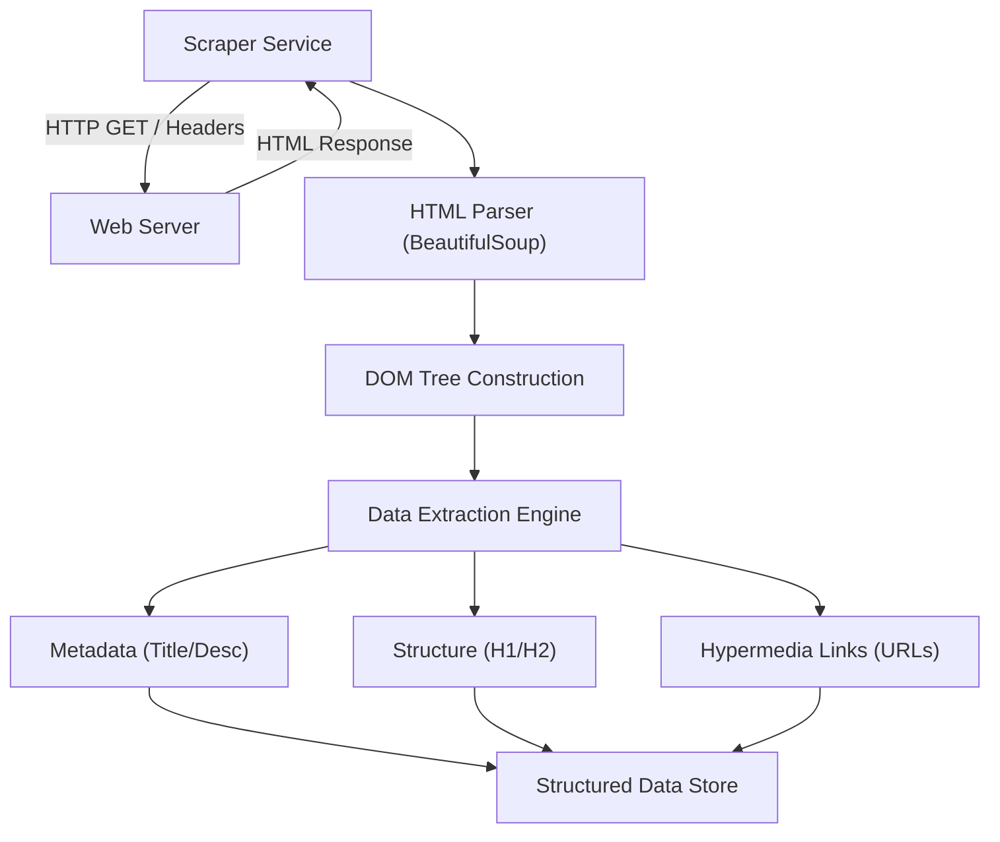

# Web Scraper (DOM Traversal & Data Mining)

**Authors:**
- [Amey Thakur](https://github.com/Amey-Thakur) ([ORCID: 0000-0001-5644-1575](https://orcid.org/0000-0001-5644-1575))
- [Mega Satish](https://github.com/msatmod) ([ORCID: 0000-0002-1844-9557](https://orcid.org/0000-0002-1844-9557))

**Release Date:** January 9, 2022  
**License:** MIT License

---

## Quick Start
To execute this implementation, install the required dependency and run:
```bash
pip install -r requirements.txt
python WebScraper.py
```

## 1. Definition
A **Web Scraper** is a software agent tasked with the automated extraction of data from websites. Unlike web crawling, which focuses on indexing, scraping targets specific data points within the **Document Object Model (DOM)** of a webpage, transforming unstructured HTML into structured data formats like JSON or CSV.

## 2. Technical Explanation
Web scraping involves several layers of the ISO/OSI model:
1.  **Transport Layer**: Using TCP/HTTP(S) to request the resource.
2.  **Presentation Layer**: Parsing the binary HTML stream into a hierarchical tree.
3.  **Application Layer**: Identifying and selecting specific DOM nodes (text, attributes, or links).

The selection process often uses **CSS Selectors** or **XPath** expressions to navigate the tree:
- **CSS Selector**: `article > h1`
- **XPath**: `//div[@class='content']/p[1]`

## 3. Computer Science Theory
- **DOM Traversal**: The HTML document is represented as a tree of objects. Scraping is essentially a depth-first or breadth-first search through this tree to locate target leaf nodes.
- **Regular Expressions vs. Parsing**: While Regex can extract strings, it is fundamentally incapable of parsing the non-regular language of HTML (as HTML is not a regular grammar). Scholarly scraping requires context-aware parsers like LXML or HTML5lib.
- **Ethics & Rate Limiting**: Professional scrapers must adhere to the `robots.txt` exclusion standard and implement **exponential backoff** to avoid triggering Denial of Service (DoS) protections.
- **User-Agent Spoofing**: Mimicking a web browser (e.g., Chrome or Firefox) to bypass basic bot-detection filters.

## 4. Python Implementation Logic
- **`WebScraperService`**: A modular class using `requests` for networking and `BeautifulSoup` for structural parsing.
- **Header Analysis**: Extracts <h1> and <h2> tags to determine the semantic layout of the target document.
- **Metadata Harvesting**: Scans the `<head>` section for SEO attributes and document titles.
- **Hyperlink Discovery**: Maps the outbound graph of the document by retrieving all `href` attributes from anchor tags.

## 5. Visual Representation

### Web Harvesting Architecture
The analytic engine fetches, parses, and deconstructs remote documents into verified data streams.




