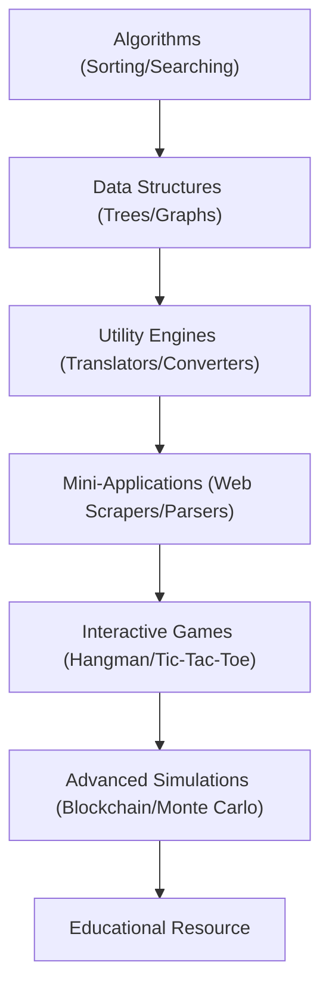

# Technical Specification: Python Shorts

## Architectural Overview

**Python Shorts** is a comprehensive, modular repository architecture designed to provide a diverse collection of over 100 Python programs. The project serves as an extensive study into functional programming, algorithmic efficiency, and specialized library integrations, ranging from fundamental data structures to complex machine learning simulations.

### Repository Modular Flow

---

## Technical Implementations

### 1. Core Computational Engine
-   **Runtime Environment**: Optimized for **Python 3.x**, leveraging both the **Standard Library** for core logic and specialized third-party frameworks for complex operations.
-   **Modular Design**: Implements a highly decoupled folder-based architecture where each module maintains its own dependencies (`requirements.txt`) and documentation.

### 2. Specialized Frameworks & Libraries
-   **Computer Vision & Imaging**: Utilizes **`opencv-python`** and **`Pillow`** for image processing, metadata extraction, and text-to-handwriting synthesis.
-   **Data Processing & Intelligence**: Implements **`numpy`**, **`pandas`**, and **`nltk`** for numerical analysis, sentiment analysis, and text summarization pipelines.
-   **GUI & Web Interfacing**: Deploys **`requests`**, **`beautifulsoup4`**, and **`pyttsx3`** for web scraping, API interactions, and speech synthesis.

### 3. Engineering Frameworks
-   **Algorithmic Pipelines**: Structured implementations of classic sorting (Quick, Merge, Shell), graph traversals (BFS, DFS), and optimization algorithms (A-Star, Dijkstra).
-   **Simulation Engines**: Integrates Monte Carlo simulations, Game of Life, and Mandelbrot set visualizations for computational mathematics research.

---

## Technical Prerequisites

-   **Runtime**: Python 3.8 or higher ([Python.org](https://www.python.org/)).
-   **Development**: VS Code, PyCharm, or any standard Python IDE.
-   **Dependencies**: Module-specific `pip install -r requirements.txt` synchronization for required external suites.

---

*Technical Specification | Python Shorts | Version 1.0*
